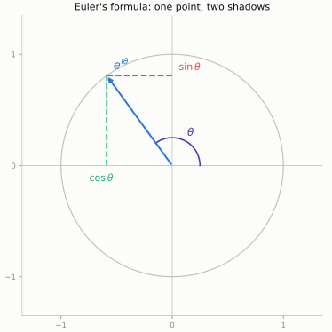
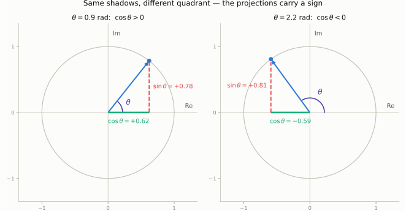
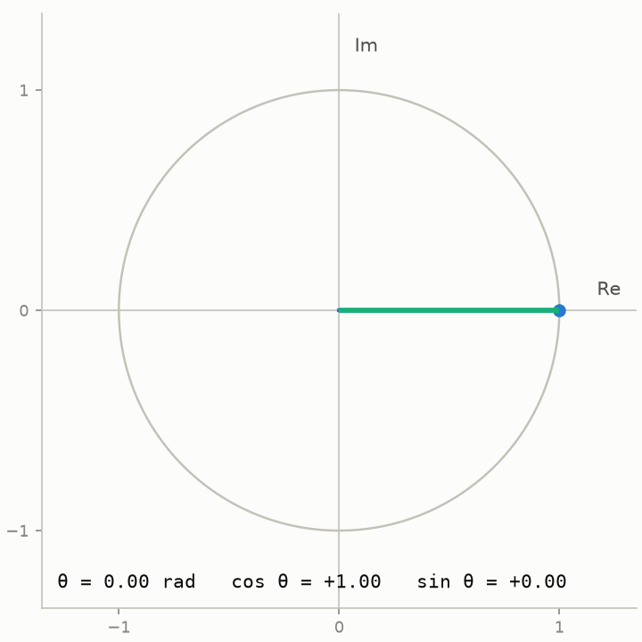
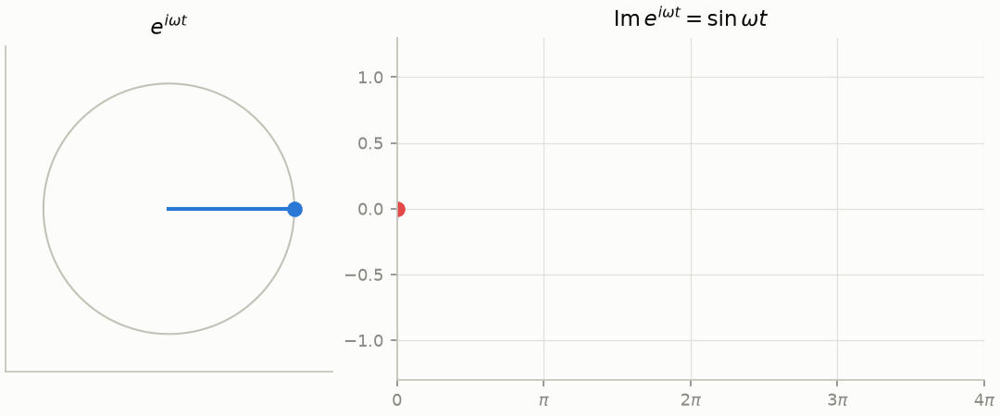
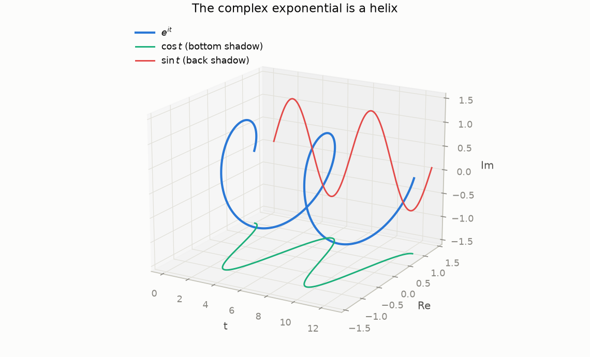
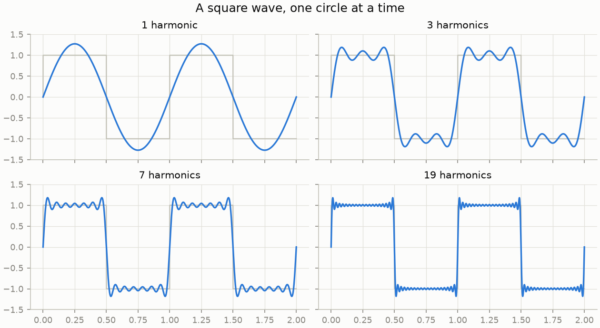
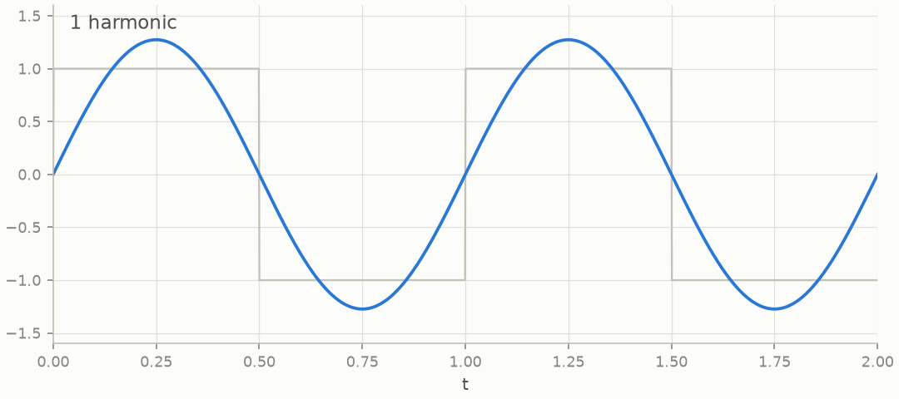
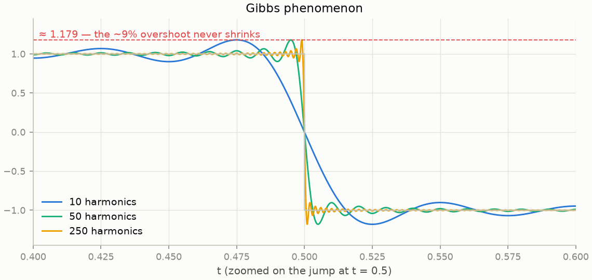
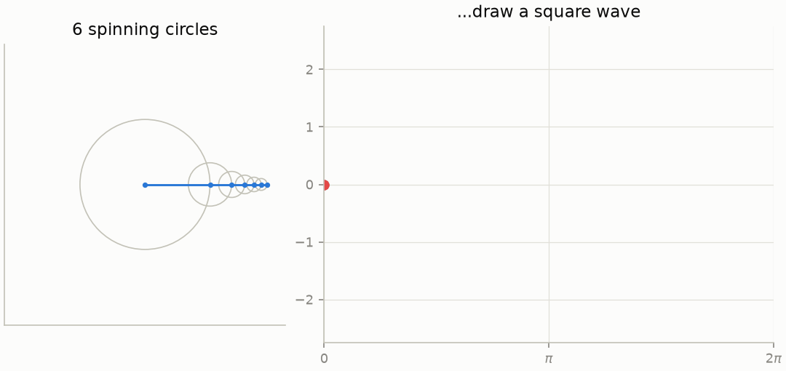
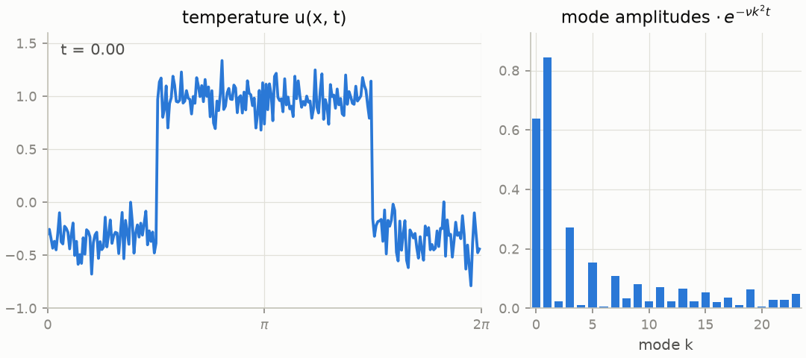

+++
title = "Heat, Circles, and Euler's Formula"
description = "Part 1 of a series on the Fourier transform: where it came from, square waves as a sum smooth sinusoidal waves, and Epicycles."
date = 2026-07-02
[taxonomies]
tags = ["math", "fourier", "python", "jax"]
+++

_This is part 1 of a 4-part series. All figures are generated by
[deterministic scripts](https://github.com/MarioDanielPanuco/Fourier-Transform) —
`pixi run figs-post1` reproduces every image on this page._

## A scandalous claim about heat

On December 21, 1807, [Joseph Fourier](https://en.wikipedia.org/wiki/Joseph_Fourier)
presented a memoir to the Institut de France, _Mémoire sur la propagation de la chaleur
dans les corps solides_, on how heat spreads through a solid body. Buried in it was a
claim that his reviewers — Lagrange and Laplace among them — found hard to accept:
**any** initial temperature distribution, even a jagged or discontinuous one, could be
written as an infinite sum of sines and cosines.

The objection wasn't pedantry. Fifty years earlier, d'Alembert, Euler, and Daniel
Bernoulli had argued about exactly this in the context of
[a vibrating string](https://en.wikipedia.org/wiki/Wave_equation), and the
prevailing intuition said a sum of smooth waves must itself be smooth — so how could it
ever equal a function with a corner or a jump? Lagrange never fully came around.
[Fourier's memoir was rejected for rigor](https://mathshistory.st-andrews.ac.uk/Biographies/Fourier/),
revised for the Academy's 1811 prize competition on heat — which it won, still over
its referees' complaints — and the mature theory finally appeared in 1822 as the
[_Théorie analytique de la chaleur_](https://en.wikipedia.org/wiki/Th%C3%A9orie_analytique_de_la_chaleur).
Making his claim precise took much of the nineteenth century and, along the way, forced
mathematics to sharpen its ideas of _function_, _limit_, and _integral_ —
[Riemann's integral](https://en.wikipedia.org/wiki/Riemann_integral) was developed in a
paper on trigonometric series, and
[Cantor's set theory](https://en.wikipedia.org/wiki/Georg_Cantor) began with the
question of when two trigonometric series that agree must have equal coefficients.

The idea itself, though, is older than the controversy. Ptolemy's astronomy modeled
planetary orbits as circles riding on circles —
[_epicycles_](https://en.wikipedia.org/wiki/Deferent_and_epicycle). That is Fourier
analysis in disguise: approximate a motion by a sum of uniform circular motions. We'll
make that literal by the end of this post.

## Euler's formula: one point, two shadows

Everything in this series runs through a single identity, published by Euler in 1748:

$$
e^{i\theta} = \cos\theta + i\sin\theta .
$$

One way to earn it is through the Taylor series. Take the exponential series, which
converges everywhere,

$$
e^x = \sum_{n=0}^{\infty} \frac{x^n}{n!},
$$

and feed it an imaginary argument $x = i\theta$. Powers of $i$ cycle with period four:
$i^2 = -1$, $i^3 = -i$, $i^4 = 1$. Collecting the real and imaginary terms:

$$
e^{i\theta}
= \underbrace{\left(1 - \frac{\theta^2}{2!} + \frac{\theta^4}{4!} - \cdots\right)}\_{\cos\theta}
\\,+\\, i\underbrace{\left(\theta - \frac{\theta^3}{3!} + \frac{\theta^5}{5!} - \cdots\right)}\_{\sin\theta}.
$$

The two series that fall out are exactly the Taylor series of cosine and sine.

If series manipulation feels like a card trick, here is the differential-equation
argument. Let $f(\theta) = e^{-i\theta}(\cos\theta + i\sin\theta)$. Differentiating
with the product rule gives $f'(\theta) = 0$ everywhere, so $f$ is constant\; since
$f(0) = 1$, the two sides agree for all $\theta$. Both $e^{i\theta}$ and
$\cos\theta + i\sin\theta$ are the unique solution of $y' = iy$ with $y(0)=1$ — they
are the same function described twice.

Geometrically, $e^{i\theta}$ is a point on the unit circle at angle $\theta$, and
cosine and sine are its two shadows — the projections onto the real and imaginary axes:

One subtlety in this picture is worth pausing on, because it trips people up (it
tripped me up): $\cos\theta$ and $\sin\theta$ are **signed coordinates**, not lengths
of a triangle. In the first quadrant the picture looks like ordinary right-triangle
trigonometry, and it's tempting to read the two dashed segments as positive side
lengths. But push $\theta$ past $\pi/2$ and the horizontal shadow now points in the
_negative_ real direction — the triangle looks the same, while $\cos\theta$ has
quietly flipped sign:

Sweeping $\theta$ all the way around makes the bookkeeping obvious — each projection
changes sign exactly when the point crosses the corresponding axis, which is precisely
why cosine and sine oscillate between $+1$ and $-1$ rather than being humps of positive
"length":

Set $\theta = \pi$ and the point lands at $-1$, giving the poster identity
$e^{i\pi} + 1 = 0$. But the working form, the one we'll use constantly, is
$\theta = \omega t$: a point moving around the circle at constant angular speed
$\omega$. Watch its vertical shadow and you get a sine wave\; the horizontal shadow is
a cosine:

This is the fundamental dictionary entry: **uniform circular motion ↔ sinusoidal
oscillation**. A "frequency" is a rotation rate. Everything the Fourier transform does
is bookkeeping over a collection of these rotating points, called _phasors_.

## Negative frequency isn't mysterious

In three dimensions — time along one axis, the complex plane in cross-section — the
function $e^{it}$ is a helix. Cosine and sine are what you see when you flatten the
helix against the floor or the back wall:

A helix has a handedness, and that is all a negative frequency is: $e^{-i\omega t}$
spins clockwise where $e^{i\omega t}$ spins counterclockwise. A real signal has no
handedness to prefer, so it must carry both rotations in equal measure. That is the
content of the identity

$$
\cos\omega t = \frac{e^{i\omega t} + e^{-i\omega t}}{2},
$$

which says a real oscillation is two counter-rotating phasors whose imaginary parts
cancel. When you later see the spectrum of a real signal come out symmetric — every
spike at $+\omega$ mirrored at $-\omega$ — this is why. Nothing is "vibrating
backwards in time"\; the two half-amplitude rotations simply conspire to keep the sum
real.

## Fourier series: projection onto rotations

Fourier's claim, in modern dress: a reasonable periodic function $f$ with period
$2\pi$ can be written as

$$
f(t) = \sum_{n=-\infty}^{\infty} c_n\\, e^{i n t},
\qquad
c_n = \frac{1}{2\pi} \int_0^{2\pi} f(t)\\, e^{-i n t}\\, dt .
$$

The formula for $c_n$ is not pulled from a hat. The complex exponentials are
**orthogonal** on the interval:

$$
\frac{1}{2\pi}\int_0^{2\pi} e^{i n t}\\, \overline{e^{i m t}}\\, dt =
\begin{cases} 1 & n = m \\\\ 0 & n \neq m \end{cases}
$$

so they behave exactly like perpendicular unit vectors, and $c_n$ is an ordinary dot
product — the component of $f$ along the direction $e^{int}$. Fourier analysis is
linear algebra in a space where the "vectors" are functions and the orthonormal basis
is the family of rotation rates. That framing is worth internalizing now, because in
part 2 the integral becomes a finite sum, the basis becomes genuinely finite, and the
whole thing becomes a literal matrix.

For a square wave the integrals come out to odd harmonics with $1/n$ amplitudes:

$$
\mathrm{square}(t) = \frac{4}{\pi}\left(\sin t + \frac{\sin 3t}{3} + \frac{\sin 5t}{5} + \cdots\right).
$$

Here is that sum converging, first as snapshots, then as an animation:

Lagrange's skepticism deserves one concession. Zoom in on the jump and you find the
partial sums always overshooting by about 9% of the jump height. Adding more terms
squeezes the overshoot into a narrower sliver but never shrinks its height — the
[**Gibbs phenomenon**](https://en.wikipedia.org/wiki/Gibbs_phenomenon). The series
converges at every point, yet not _uniformly_ near the discontinuity:

The overshoot lands at $\frac{2}{\pi}\int_0^\pi \frac{\sin s}{s}\\,ds \approx 1.179$
for a jump from $-1$ to $1$. This isn't a numerical artifact\; it will come back in
part 3 as a genuine argument for wavelets, which handle jumps far more gracefully.

## Epicycles: the series you can watch

Each term $c_n e^{int}$ is a phasor: a stick of length $|c_n|$ rotating at rate $n$.
The series says: chain the sticks tip-to-tail and the end of the chain traces the
function. For the square wave, six circles already do a passable job:

This is Ptolemy's machinery pointed at a waveform instead of a planet — and it's
honest mathematics, not just a pretty picture. The largest circle is the fundamental\;
each smaller, faster circle is a correction term. (The same construction with complex
coefficients traces closed curves in the plane, which is how those "draw anything with
epicycles" animations work: sample the outline, compute the coefficients — by the end
of part 2 you'll know the fast way — and chain the phasors.)

## Why sines? Ask the heat equation

One question remains from 1807: why would sines and cosines be the natural currency
for _heat_, of all things? The heat equation on a ring is

$$
\frac{\partial u}{\partial t} = \nu\\, \frac{\partial^2 u}{\partial x^2},
$$

and the answer is that complex exponentials are **eigenfunctions** of the operator
$\partial^2 / \partial x^2$: differentiating $e^{ikx}$ twice just multiplies it by
$-k^2$. So if you expand the initial temperature in Fourier modes,
$u(x, 0) = \sum_k c_k e^{ikx}$, the equation stops coupling anything to anything —
each mode evolves alone, by an ordinary one-line ODE, and

$$
u(x, t) = \sum_k c_k\\, e^{-\nu k^2 t}\\, e^{i k x}.
$$

The factor $e^{-\nu k^2 t}$ is the whole story of diffusion: every mode decays
exponentially, and the rate grows with the _square_ of the frequency. Wiggles die
fast\; broad features linger. Watch a jagged temperature profile smooth itself out
while its spectrum collapses from the high end:

This is why Fourier invented the series: the right basis turns a partial differential
equation into a family of independent, trivially solvable ordinary ones. _Diagonalize
the operator, and the physics falls apart into non-interacting pieces._ That single
move — change to the basis where your operator is diagonal — is the through-line of
this series. In part 2 it becomes the FFT and spectral methods\; in part 3, the
"diagonalize, act, transform back" pattern returns with learned weights in the middle,
as a neural operator.

## One idea, rediscovered everywhere

There is a final historical point worth making, because it's the best argument I know
for the "unreasonable effectiveness" of applied mathematics. Fourier's decomposition
wasn't invented once — nature kept forcing it on people who were looking at completely
different problems:

- **Astronomy.** Ptolemy's
  [epicycles](https://en.wikipedia.org/wiki/Deferent_and_epicycle) _are_ a finite
  Fourier series for a periodic orbit, arrived at ~1,700 years early by fitting
  circles to the sky. Modern astronomy still runs on the same mathematics — radio
  interferometers like the VLA and the Event Horizon Telescope measure the Fourier
  transform of the sky's brightness directly, and reconstruct the image from it.
- **Crystallography.** When X-rays scatter off a crystal, the diffraction pattern on
  the detector is the
  [Fourier transform of the electron density](https://en.wikipedia.org/wiki/X-ray_crystallography).
  Solving a structure — including DNA's — is literally the problem of inverting a
  Fourier transform whose phases were lost in measurement.
- **Chemistry and medicine.** An
  [FT-NMR spectrometer](https://en.wikipedia.org/wiki/Fourier-transform_spectroscopy)
  hits nuclei with a pulse and records the decaying echo; the spectrum _is_ its
  Fourier transform. [Richard Ernst won the 1991 Nobel Prize in Chemistry](https://www.nobelprize.org/prizes/chemistry/1991/summary/)
  for realizing this beats scanning frequencies one at a time — and MRI reconstructs
  images from exactly the same k-space mathematics.
- **Physics.** LIGO finds gravitational waves by
  [matched filtering](https://en.wikipedia.org/wiki/Matched_filter) — correlating
  the strain data against template waveforms, computed as products in the frequency
  domain because convolution is cheap there. (That convolution theorem is the
  centerpiece of part 2.)
- **Computational fluids.** [Spectral methods](https://en.wikipedia.org/wiki/Spectral_method)
  solve the Navier–Stokes equations by evolving Fourier coefficients instead of grid
  values — the standard tool for simulating turbulence, and the direct ancestor of the
  neural operators in part 3.
- **Your screen.** JPEG and most video codecs quantize the
  [discrete cosine transform](https://en.wikipedia.org/wiki/Discrete_cosine_transform)
  — a real-valued cousin of the DFT — throwing away the high-frequency coefficients
  your eye won't miss.

None of these fields set out to do "Fourier analysis." Each found that its signals,
when written in the basis of oscillations, became simple — because waves, diffusion,
and periodic motion are what the physical world is made of, and this is the basis that
diagonalizes them. That is the recurring miracle of applied math: a representation
invented to settle an argument about heat turns out to be something nature had already
committed to.

## Where this goes

**Part 2** discretizes: the Fourier series becomes the DFT (a matrix), the FFT makes
it fast, and the convolution theorem plus spectral derivatives make it useful — with
detours through sampling, aliasing, and what a spectrogram of an actual song looks
like. **Part 3** covers what Fourier _can't_ do — localize in time and frequency at
once — and follows wavelets to a modern endpoint: wavelet neural operators, trained in
JAX on Burgers' equation.

### Further reading

- Körner, _Fourier Analysis_ — the historical threads here are drawn out beautifully.
- Stein & Shakarchi, _Fourier Analysis: An Introduction_ — the projection viewpoint, done properly.
- The [MacTutor biography of Fourier](https://mathshistory.st-andrews.ac.uk/Biographies/Fourier/) —
  the full story of the 1807 memoir, the 1811 prize, and the feud with Lagrange,
  with references to the primary documents.
- Kahane, [_Le retour de Fourier_](https://www.academie-sciences.fr/pdf/dossiers/Fourier/Fourier_pdf/Fourier_Kahane.pdf)
  (Académie des sciences, in French) — a mathematician's account of how Fourier's
  reputation went from "not rigorous" to foundational.
- The Wikipedia entries on [Fourier analysis](https://en.wikipedia.org/wiki/Fourier_analysis)
  and the [Fourier series](https://en.wikipedia.org/wiki/Fourier_series) are both
  unusually good, with real history sections.
- 3Blue1Brown's videos on Euler's formula and Fourier series, if you want these animations with a voiceover.
