+++
title = "From Series to Samples: the DFT, the FFT, and Why Convolution Is Multiplication"
description = "Part 2 of a series on the Fourier transform: the discrete transform as a matrix, the Cooley–Tukey trick, aliasing, spectrograms of actual music, and spectral methods for PDEs."
date = 2026-07-03
[taxonomies]
tags = ["math", "fourier", "python", "jax", "scientific-computing"]
+++

*This is part 2 of a 4-part series
([part 1](@/posts/post-1-origins/index.md) covered Euler's formula and Fourier series).
Every figure is generated by
[deterministic scripts](https://github.com/MarioDanielPanuco/Fourier-Transform) —
`pixi run figs-post2` reproduces this page.*

## Discretizing: the DFT is a matrix

Computers don't integrate\; they sum. Sample a signal at $N$ points and the Fourier
series coefficients from part 1 become the
[**discrete Fourier transform**](https://en.wikipedia.org/wiki/Discrete_Fourier_transform):

$$
X_k = \sum_{n=0}^{N-1} x_n\\, e^{-2\pi i\\, k n / N},
\qquad
x_n = \frac{1}{N}\sum_{k=0}^{N-1} X_k\\, e^{+2\pi i\\, k n / N}.
$$

Everything is built from one complex number, $\omega = e^{2\pi i / N}$ — a single
click of a clock hand with $N$ positions. Its powers are the
[**$N$-th roots of unity**](https://en.wikipedia.org/wiki/Root_of_unity), and they are
the DFT's entire alphabet:

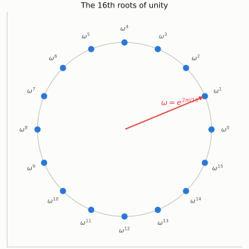

Because the sum is finite, the DFT is literally a
[matrix-vector product](https://en.wikipedia.org/wiki/DFT_matrix)
$X = W x$ with $W_{k n} = \omega^{-k n}$. Row $k$ of the matrix is a phasor spinning
$k$ times around the circle, sampled $N$ times — you can *see* the frequencies rise
as you read downward:

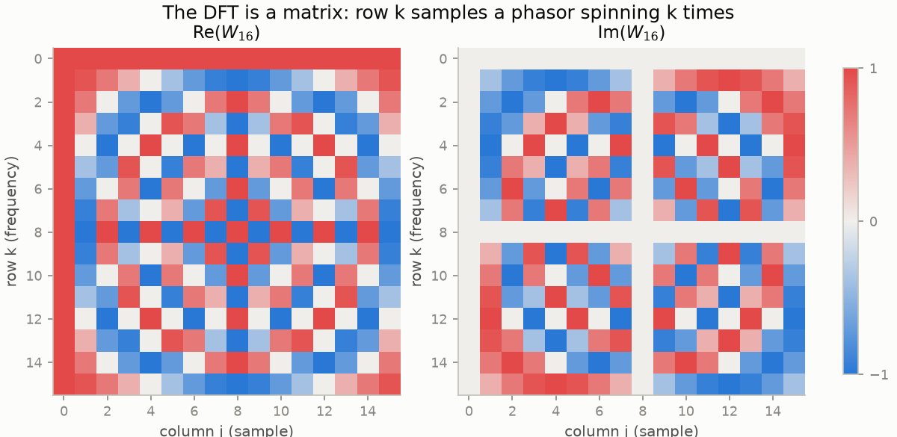

The orthogonality of complex exponentials survives discretization exactly:
$W^* W = N I$, so $W/\sqrt{N}$ is unitary. The DFT is a rigid rotation of
$\mathbb{C}^N$ — no information created or destroyed, just re-expressed.
[Parseval's theorem](https://en.wikipedia.org/wiki/Parseval%27s_theorem)
($\sum |x_n|^2 = \frac{1}{N}\sum |X_k|^2$) is nothing more than "rotations
preserve length."

One more consequence of the matrix view, and it's a fun one. Applying the transform
twice gives $W^2 = N \cdot P$, where $P$ reverses indices *circularly*:

$$
\mathrm{FFT}(\mathrm{FFT}(x))[n] = N\\, x[(-n)\ \mathrm{mod}\ N].
$$

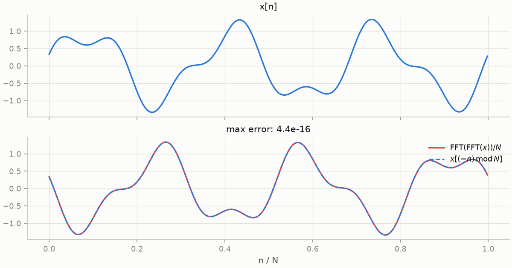

So $W^4 = N^2 I$: four FFTs bring you home. That forces the eigenvalues of
$W/\sqrt{N}$ to be fourth roots of unity, $\lbrace 1, i, -1, -i \rbrace$ — the same
reason the continuous transform has the Gaussian and Hermite functions as
eigenfunctions. The DFT isn't just *like* a rotation\; it's very nearly a
quarter-turn.

## Sampling has a speed limit

Discretizing costs something, and the price is paid at high frequency. At a sampling
rate $f_s$, the frequencies $f$ and $f + f_s$ produce **identical samples** — on the
roots-of-unity clock, spinning $k$ clicks per step is indistinguishable from
$k + N$. Two genuinely different sinusoids, one set of samples:

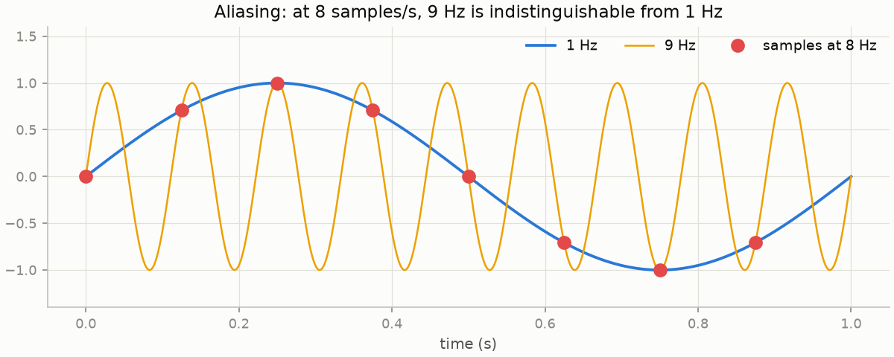

The [**Nyquist–Shannon theorem**](https://en.wikipedia.org/wiki/Nyquist%E2%80%93Shannon_sampling_theorem)
draws the line: a signal containing frequencies only
below $f_s / 2$ is *exactly* recoverable from its samples. Push past it and
frequencies fold back down like a reflected ruler — a tone sweeping upward past
Nyquist appears to bounce off the ceiling and descend:

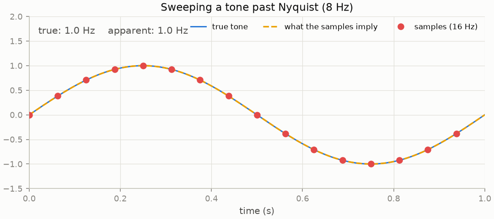

This is why anti-aliasing filters sit in front of every analog-to-digital converter,
why wagon wheels spin backwards in westerns, and — foreshadowing part 3 — why the
"downsample by 2" step inside a wavelet transform must be paired with a filter that
removes the top half-band first.

## The FFT: divide, conquer, and a footnote from Gauss

Multiplying by $W$ costs $O(N^2)$. The **fast Fourier transform** computes the same
$X$ in $O(N \log N)$ by exploiting the clock's symmetry. Split the sum into even and
odd samples:

$$
X_k = \underbrace{\sum_m x_{2m}\\, \omega^{-2mk}}\_{E_k}
\\;+\\; \omega^{-k} \underbrace{\sum_m x_{2m+1}\\, \omega^{-2mk}}\_{O_k}
$$

Both halves are themselves DFTs of size $N/2$, and — the crucial bit — the second
half of the output reuses them with only a sign flip:
$X_{k + N/2} = E_k - \omega^{-k} O_k$. Two half-size problems plus $O(N)$ glue:

$$
T(N) = 2\\,T(N/2) + O(N) \implies T(N) = O(N \log_2 N).
$$

Unrolled, the recursion becomes $\log_2 N$ stages of "butterfly" operations:

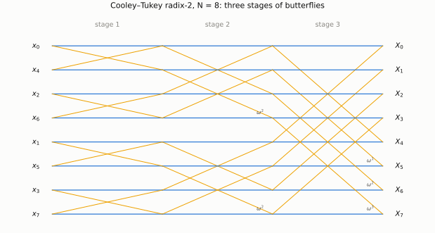

The asymptotic gap is not academic:

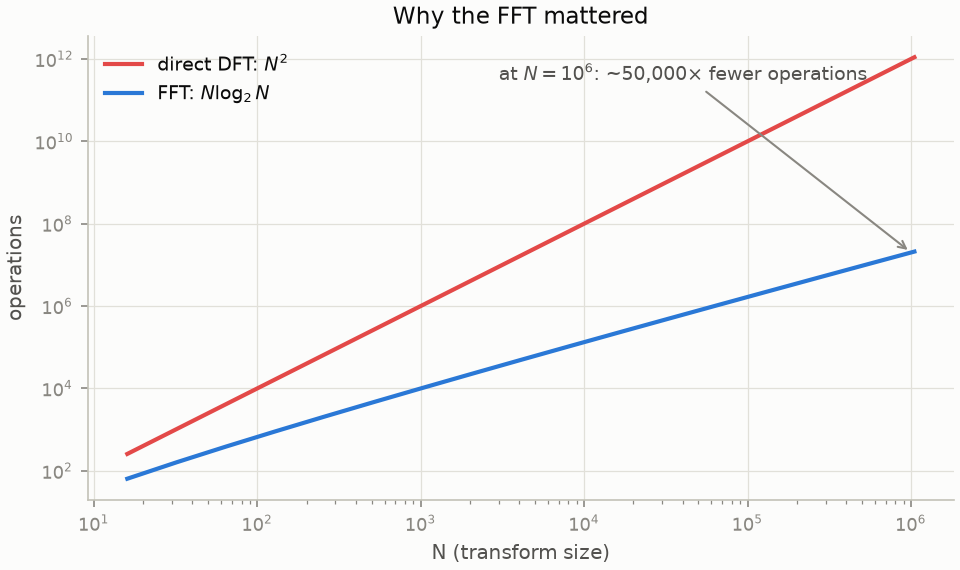

[Cooley and Tukey published in 1965](https://www.ams.org/journals/mcom/1965-19-090/S0025-5718-1965-0178586-1/),
[motivated in part by detecting Soviet nuclear tests](https://en.wikipedia.org/wiki/Cooley%E2%80%93Tukey_FFT_algorithm)
from seismometer data — a problem where transforms of long records had to be
feasible. [Gauss had the same algorithm in an unpublished 1805 notebook](https://link.springer.com/article/10.1007/BF00348431),
two years before Fourier's memoir, for interpolating asteroid orbits. It was
rediscovered because it was *needed*\; the lesson about publishing your tricks writes
itself.

## The convolution theorem: the workhorse

Here is [the identity](https://en.wikipedia.org/wiki/Convolution_theorem) that makes
the FFT an engine rather than a curiosity.
[**Convolution**](https://en.wikipedia.org/wiki/Convolution) blends one sequence with
another:

$$
(x * y)[n] = \sum_m x[m]\\, y[n - m]
$$

— it's the operation behind moving averages, filters, blurs, echoes, polynomial
multiplication, and probability distributions of sums. Computed directly it costs
$O(N^2)$. But in the frequency domain it collapses to *pointwise multiplication*:

$$
\mathrm{DFT}(x * y) = \mathrm{DFT}(x) \cdot \mathrm{DFT}(y).
$$

The proof is two lines with the geometric series and worth doing once by hand:
substitute the definition, swap the sums, and the roots-of-unity orthogonality does
the rest. So the fast recipe for any convolution is: transform ($N \log N$),
multiply ($N$), transform back ($N \log N$).

Watch it do probability. A die is a probability vector\; the sum of $k$ dice is that
vector convolved with itself $k$ times, i.e. one FFT, a $k$-th power, one inverse
FFT. The central limit theorem materializes in front of you:

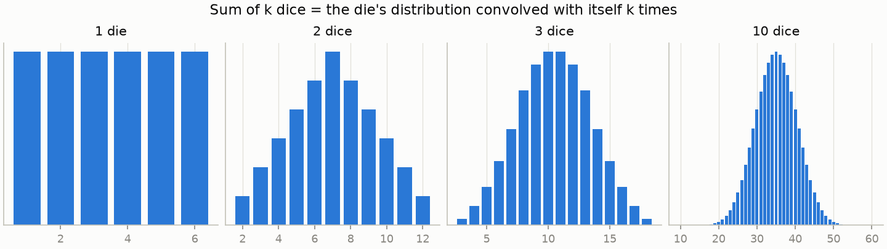

(One care: the DFT's convolution is *circular* — index arithmetic wraps mod $N$,
like everything on the clock. For a linear convolution you zero-pad both inputs to
the full output length first. The
[same trick multiplies million-digit integers](https://en.wikipedia.org/wiki/Sch%C3%B6nhage%E2%80%93Strassen_algorithm):
digits are polynomial coefficients, and carrying is a post-processing step.)

Filtering is the same theorem run for its own sake. Part 1's denoising demo — two
tones buried in noise — is just: FFT, zero every bin above 150 Hz, inverse FFT.
Multiplication by a box in frequency *is* convolution with a sinc in time:

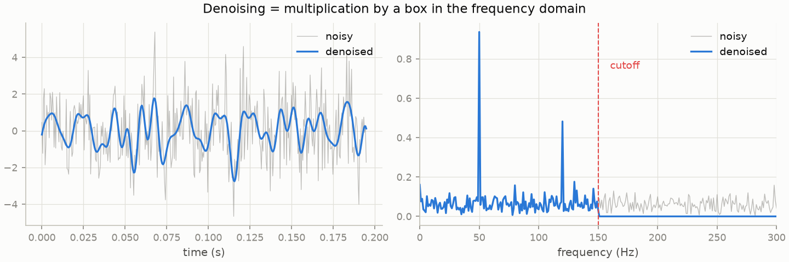

## Windows, leakage, and hearing a song

Real signals aren't periodic, but the DFT stubbornly assumes its input is one period
of something that repeats. Chop a sine wave mid-cycle and the wraparound jump
smears energy across every bin —
[**spectral leakage**](https://en.wikipedia.org/wiki/Spectral_leakage). The fix is to
fade the edges with a [*window*](https://en.wikipedia.org/wiki/Window_function)
(Hann, Hamming, Blackman...) before transforming, trading a slightly
wider peak for enormously quieter sidelobes:

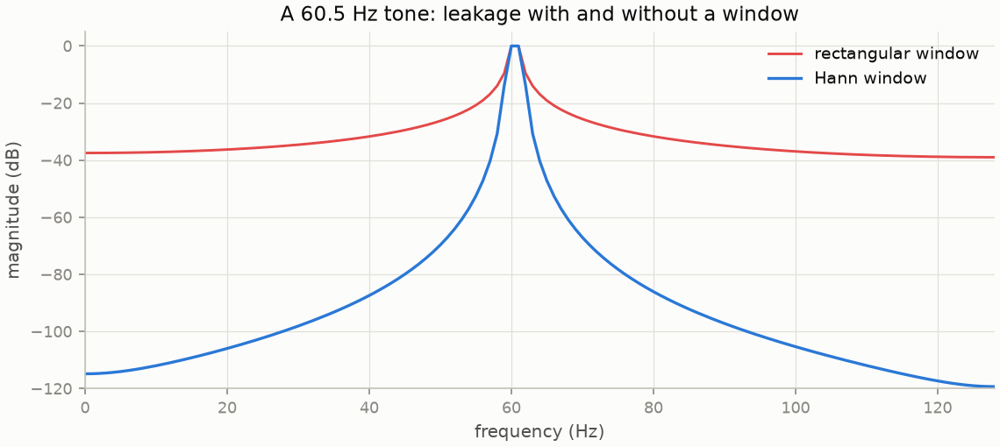

Slide a window along a long recording, FFT each hop, stack the columns, and you get
the [**short-time Fourier transform**](https://en.wikipedia.org/wiki/Short-time_Fourier_transform)
— the spectrogram, time-frequency currency of speech, audio ML, and seismology. Here's one of the mp3s sitting in this repo's
`data/` folder:

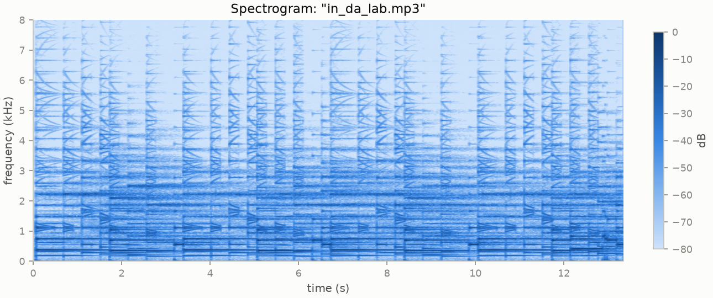

Kicks are the vertical full-band stripes, the bassline lives in the dark band under
1 kHz, hi-hats sparkle up top. Note the trade you've silently accepted: each column
knows *roughly when*, each row *roughly what frequency*, and the window length sets
the exchange rate. You cannot sharpen both at once — that tension is the opening
argument of part 3.

## Spectral methods: differentiation becomes multiplication

The eigenfunction fact from part 1 — differentiating $e^{ikx}$ multiplies it by
$ik$ — turns the FFT into a numerical-analysis power tool. To differentiate a
periodic function: transform, multiply bin $k$ by $ik$, transform back. No stencils,
no truncation order — the accuracy is limited only by how fast the function's
Fourier coefficients decay. For smooth functions that decay is exponential, and the
resulting **spectral accuracy** embarrasses finite differences:

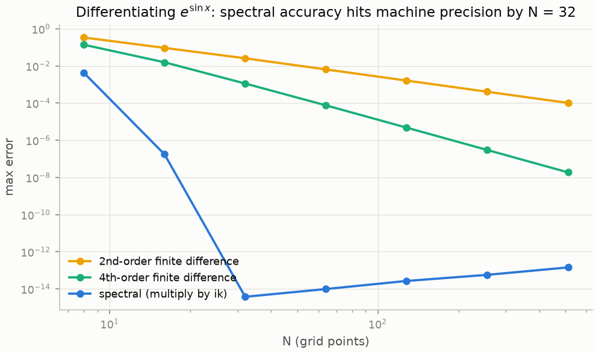

The 2nd-order stencil buys you $h^2$\; doubling the grid earns two bits of accuracy.
The spectral derivative of $e^{\sin x}$ hits machine precision at $N = 32$ and stays
there. This is the engine of pseudo-spectral PDE solvers: in part 3, the Burgers'
equation data for training a neural operator is generated exactly this way —
derivatives by $ik$ multiplication in Fourier space, time-stepping in physical
space.

Two complex-analysis footnotes deserve a sentence each, because they reappear
everywhere. First, the DFT is the
[**z-transform**](https://en.wikipedia.org/wiki/Z-transform)
$X(z) = \sum x_n z^{-n}$ evaluated at $N$ points on the unit circle — digital filter design is complex analysis on that
circle, poles inside for stability. Second, evaluating a *polynomial* on the roots
of unity is exactly what the FFT does, which is why it multiplies polynomials fast —
and evaluating a *Laurent series* on the circle connects the decay rate of Fourier
coefficients to the width of the strip where the function is analytic. Smoothness in
one domain is decay in the other, in both directions.

## Where this goes

The spectral pattern is always the same three-step: **transform, act diagonally,
transform back**. Denoising: zero some bins. Differentiation: multiply by $ik$.
Heat flow: multiply by $e^{-\nu k^2 t}$. In part 3 we meet the version where the
diagonal action is *learned from data* — a Fourier neural operator — then swap the
FFT for a wavelet transform to get localization in both time and frequency, and
train a wavelet neural operator on Burgers' equation in JAX.

### Further reading

- Trefethen, [*Spectral Methods in MATLAB*](https://people.maths.ox.ac.uk/trefethen/spectral.html) —
  chapter 1 is the spectral-derivative plot above, done first and better (programs and text free at that link).
- Brigham, *The Fast Fourier Transform and Its Applications* — the butterfly, exhaustively.
- Heideman, Johnson & Burrus, ["Gauss and the history of the FFT"](https://link.springer.com/article/10.1007/BF00348431)
  (1984) — the 1805 notebook story.
- Cooley & Tukey, ["An algorithm for the machine calculation of complex Fourier series"](https://www.ams.org/journals/mcom/1965-19-090/S0025-5718-1965-0178586-1/)
  (*Math. Comp.*, 1965) — the original, and it's only five pages.
- Stanford CS168, mini-project on Fourier methods — the dice-convolution exercise this repo's notebook grew out of.
