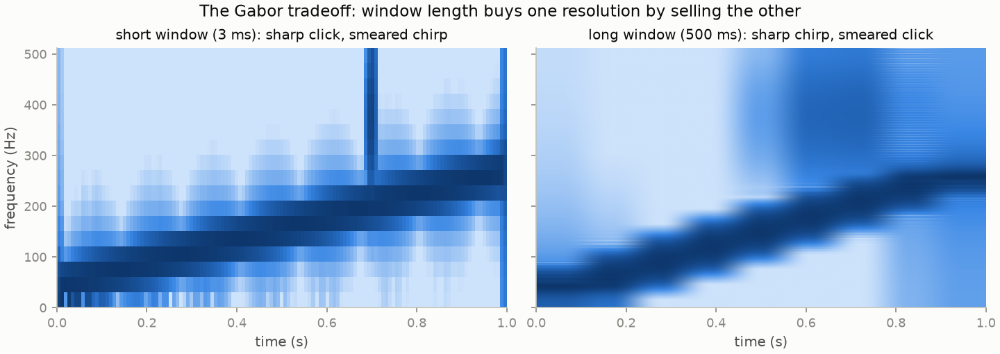
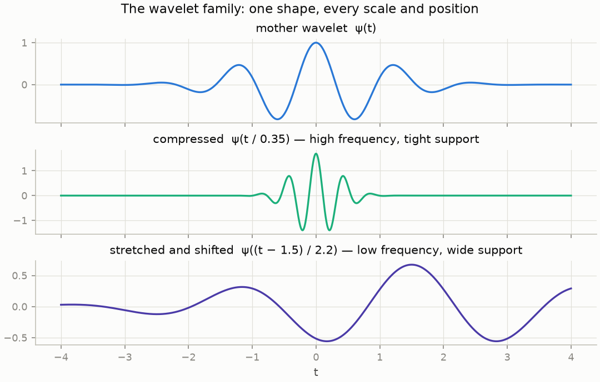
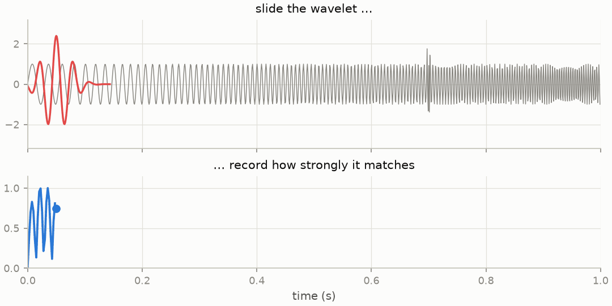
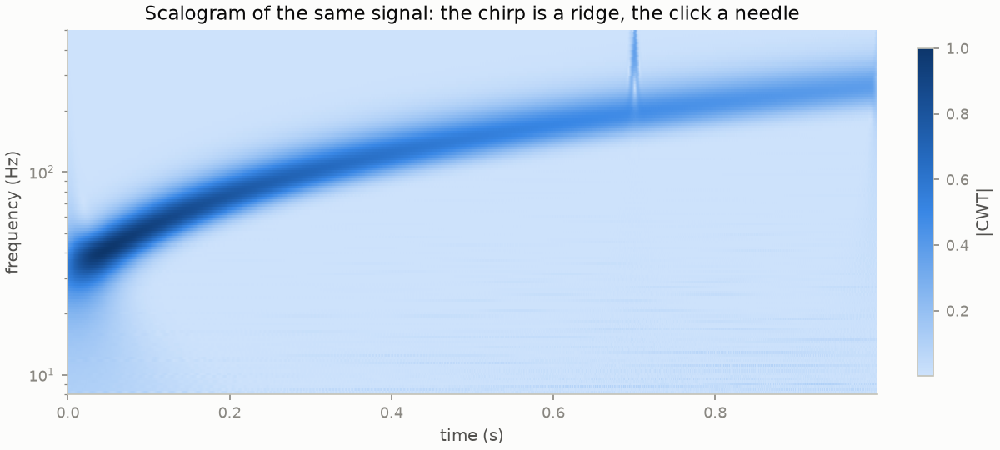
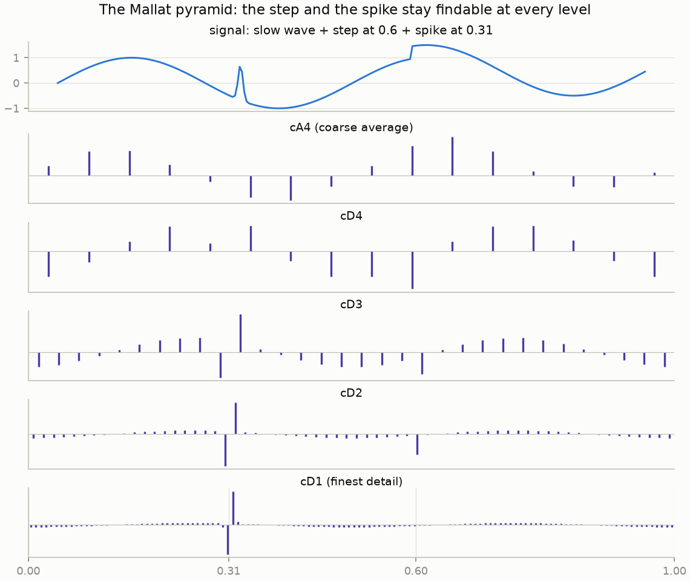
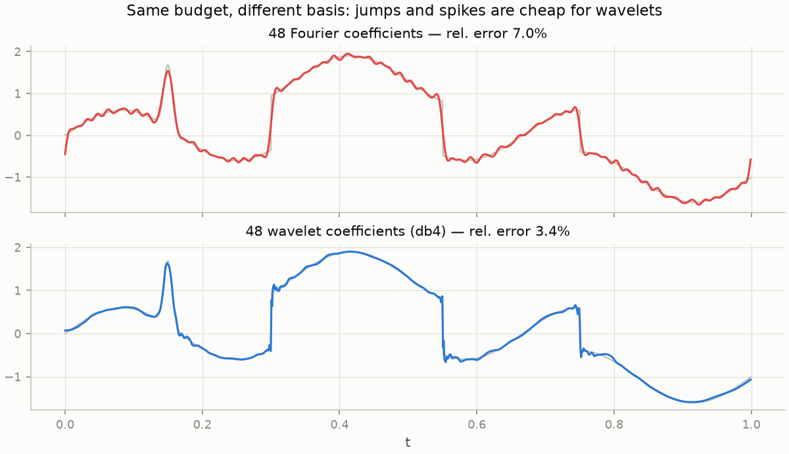
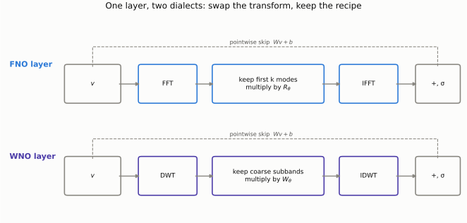
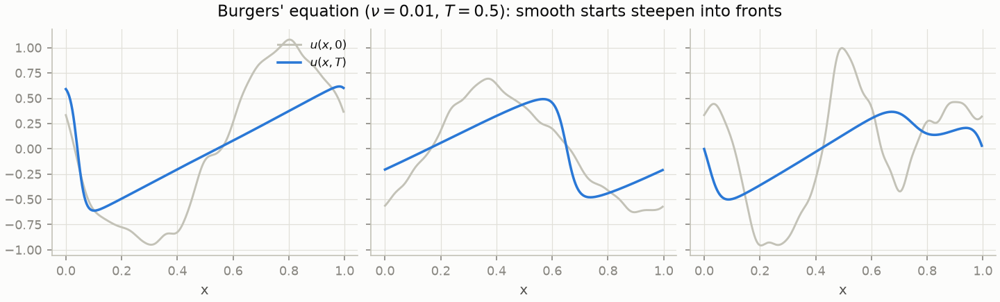
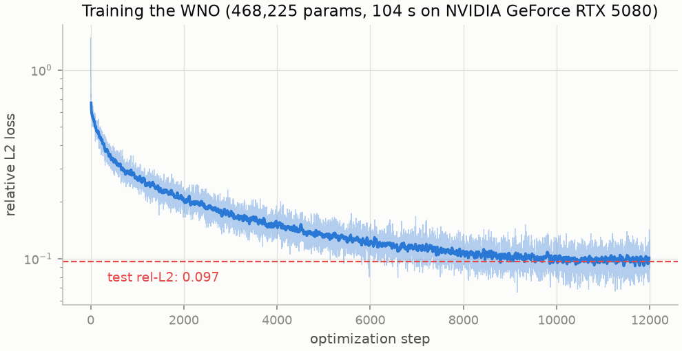
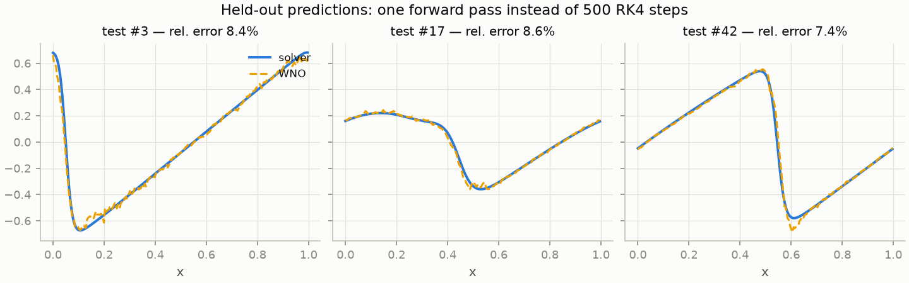

+++
title = "Beyond Fourier: Wavelets and a Crash Course on Wavelet Neural Operators"
description = "Part 3 of a series on the Fourier transform: the time-frequency tradeoff, multiresolution analysis, and training a minimal wavelet neural operator on Burgers' equation in JAX."
date = 2026-07-04
[taxonomies]
tags = ["math", "fourier", "wavelets", "jax", "machine-learning", "scientific-computing"]
+++

_This is part 3 of a 4-part series
([part 1](@/posts/post-1-origins/index.md): Euler's formula and Fourier series\;
[part 2](@/posts/post-2-dft-fft/index.md): the DFT, FFT, and spectral methods).
Figures and the trained model are reproducible from
[the repo](https://github.com/MarioDanielPanuco/Fourier-Transform):
`pixi run wno-train`, then `pixi run figs-post3`._

## Fourier's blind spot

A Fourier coefficient is an integral over _all_ time. The basis function
$e^{i\omega t}$ has perfect frequency and no location — it rings forever. So a
spectrum answers "what frequencies are present?" but is structurally incapable of
answering "_when_?" A drum hit at $t = 3\\,\mathrm{s}$ and the same hit at
$t = 30\\,\mathrm{s}$ have the same magnitude spectrum\; all the timing hides in the
phase, scrambled across every coefficient.

Part 2's fix was the spectrogram: window the signal, transform each slice. But the
window length is a contract you sign in advance. Take a signal with both a slow chirp
and a 2-millisecond click, and no single window serves both clients:



This isn't an engineering failure\; it's a theorem.
[Gabor's uncertainty principle](https://en.wikipedia.org/wiki/Gabor_limit) —
the [same inequality as Heisenberg's](https://en.wikipedia.org/wiki/Uncertainty_principle),
applied to a signal and its transform — bounds
the product of time spread and frequency spread:

$$
\Delta t \cdot \Delta \omega \ge \frac{1}{2}.
$$

You cannot beat the bound. What you _can_ do is spend it differently at different
frequencies — and that observation is the whole wavelet idea.

## Wavelets: constant-Q tiling

High-frequency events are typically brief (clicks, edges, shocks)\; low-frequency
behavior is typically long (drones, trends). So instead of one fixed window, take one
oscillating bump $\psi$ — the [**mother wavelet**](https://en.wikipedia.org/wiki/Wavelet)
— and generate a family by scaling and translating it:

$$
\psi_{a,b}(t) = \frac{1}{\sqrt{a}}\\, \psi\\!\left(\frac{t - b}{a}\right).
$$



The [**continuous wavelet transform**](https://en.wikipedia.org/wiki/Continuous_wavelet_transform)
correlates the signal against every member of the family:

$$
W(a, b) = \int_{-\infty}^{\infty} f(t)\\, \frac{1}{\sqrt{a}}\\,
\overline{\psi\\!\left(\frac{t-b}{a}\right)} dt .
$$

Small scale $a$ = a short, high-frequency probe with fine time resolution\; large $a$
= a long, low-frequency probe with fine frequency resolution. Every tile in the
time-frequency plane has the same _relative_ bandwidth (musicians: each octave gets
equal treatment — "constant-Q"). Mechanically it's just template matching, a
convolution per scale:



Stack the responses at all scales and you get the **scalogram**. Same chirp-plus-click
signal as above — now the chirp is a crisp ridge _and_ the click is a needle, localized
to milliseconds at high frequency where short probes live:



(The only real constraint on $\psi$ is the admissibility condition — zero mean and
finite $\int |\hat\psi(\omega)|^2 / |\omega|\\, d\omega$ — i.e., it must actually
_wave_.)

## The DWT: Mallat's pyramid

The CWT is gloriously redundant — a whole 2D picture from a 1D signal. For
computation you want the opposite: a basis.
[Mallat](https://doi.org/10.1109/34.192463) and
[Daubechies](https://doi.org/10.1002/cpa.3160410705) showed you can
choose scales $a = 2^j$ and shifts $b = k \cdot 2^j$ and, for the right $\psi$, get an
**orthonormal basis** — no information lost, none duplicated.
[Daubechies' families](https://en.wikipedia.org/wiki/Daubechies_wavelet)
(db2, db3, db4...) are compactly supported: each basis function touches only a few
samples.

The algorithm is a two-channel filter bank. Convolve with a lowpass filter $h$ and a
highpass filter $g$, downsample each by 2 (safe _because_ the filters halved the
band — part 2's aliasing lesson), then recurse on the lowpass half:

$$
x \longrightarrow (\\,\mathrm{cA}_1, \mathrm{cD}_1\\,)
\longrightarrow (\\,\mathrm{cA}_2, \mathrm{cD}_2, \mathrm{cD}_1\\,)
\longrightarrow \cdots
$$

Each level splits off the finest remaining detail. For $N$ samples the
[whole pyramid costs $O(N)$](https://en.wikipedia.org/wiki/Fast_wavelet_transform) —
_faster_ than the FFT. Here it is run on a signal with a slow wave, a
step, and a spike, using the simplest wavelet
([Haar](https://en.wikipedia.org/wiki/Haar_wavelet): average and difference):



The point to stare at: the spike and the step stay **findable at every level** — a
handful of large coefficients sitting at the right location. A Fourier basis would
democratically smear them across all frequencies. This is Fourier's Gibbs problem
from part 1, solved by changing basis. The consequence is _sparsity_, and it's why
this transform runs your world quietly:
[JPEG 2000](https://en.wikipedia.org/wiki/JPEG_2000) compresses images with it,
denoisers threshold small wavelet coefficients
([Donoho's soft thresholding](https://doi.org/10.1109/18.382009)), and FBI
fingerprints live in
[a wavelet format](https://en.wikipedia.org/wiki/Wavelet_scalar_quantization). A budget of 48 coefficients makes the argument
concisely:



_(The formal scaffolding behind this —
[multiresolution analysis](https://en.wikipedia.org/wiki/Multiresolution_analysis) —
is a nested ladder of approximation spaces $V_0 \subset V_1 \subset \cdots$ with $V_{j+1} = V_j \oplus
W_j$\; the wavelets span the detail spaces $W_j$. Mallat's book has the full story.)_

## Neural operators in one section

Now the modern part. Classical networks learn functions between finite-dimensional
spaces. An **operator** maps functions to functions — like "initial condition
$\mapsto$ PDE solution at time $T$", which is exactly the map we solved numerically
in part 2's spectral-methods section. Operator learning trains a network
$G_\theta : u_0(\cdot) \mapsto u(\cdot, T)$ once, then evaluates it in microseconds
per new input — a _surrogate solver_. Done right it is **discretization-invariant**:
the same weights work at any grid resolution, because the layers act on functions,
not pixel vectors.

The **Fourier Neural Operator** ([Li et al., 2020](https://arxiv.org/abs/2010.08895))
builds the layer from part 2's
three-step spectral pattern — transform, act diagonally, transform back — with the
diagonal action _learned_:

$$
v_{\mathrm{out}} = \sigma\Big( \mathcal{F}^{-1}\big( R_\theta \cdot \mathcal{F} v \big) + W v + b \Big),
$$

where $\mathcal{F}$ is the FFT along the spatial axis, $R_\theta$ holds learnable
complex weights on the lowest $k$ modes (the rest truncated to zero), and $W v + b$
is a pointwise skip connection that carries what the truncation drops. Compare: heat
flow multiplied mode $k$ by $e^{-\nu k^2 t}$\; the FNO multiplies mode $k$ by whatever
the data says. It's a learnable spectral method.

But an FFT-based layer inherits Fourier's blind spot. Global modes are a clumsy
language for sharp fronts and shocks — precisely what nonlinear PDEs love to produce.
You know the remedy from the last two sections: swap the transform. The **Wavelet
Neural Operator** ([Tripura & Chakraborty, 2022](https://arxiv.org/abs/2205.02191))
keeps the recipe and replaces
$\mathcal{F}$ with the DWT, putting the learnable weights on wavelet subbands:



Because wavelet coefficients are localized, the learned kernel can treat a front at
$x = 0.3$ differently from smooth flow at $x = 0.7$ — spatial adaptivity that global
Fourier modes can't express. Empirically WNOs hold up better on sharp-gradient,
non-periodic, and boundary-dominated problems.

## A minimal WNO in JAX

Everything below is in the repo under
[`src/ftx/wno/`](https://github.com/MarioDanielPanuco/Fourier-Transform) — four short
files, pure JAX plus [jaxwt](https://github.com/v0lta/Jax-Wavelet-Toolbox) for a
differentiable DWT.

**The problem.** Viscous
[Burgers' equation](https://en.wikipedia.org/wiki/Burgers%27_equation) on the periodic
unit interval — the classic toy for "smooth in, sharp out":

$$
\frac{\partial u}{\partial t} + u \frac{\partial u}{\partial x}
= \nu \frac{\partial^2 u}{\partial x^2},
\qquad \nu = 0.01 .
$$

Learn the operator $u(\cdot, 0) \mapsto u(\cdot, 0.5)$ on a 256-point grid.

**The data** is part 2 made executable: 1,128 random smooth initial conditions
(Fourier coefficients with $1/k^2$ amplitudes), each integrated pseudo-spectrally —
derivatives via `rfft`/`irfft`, 2/3-rule dealiasing, integrating-factor RK4 so the
stiff diffusion term is handled exactly. `jax.vmap` over samples, `jax.lax.scan` over
time\; the whole dataset generates in seconds on a CPU. The advection term steepens
every smooth start into fronts:



**The model** is three WNO blocks between a lift and a projection:

```python
def _wno_block(p, v):                      # v: (batch, n, width)
    batch, n, width = v.shape
    vc = v.transpose(0, 2, 1).reshape(batch * width, n)
    coeffs = dwt(vc)                       # jaxwt.wavedec, db4, 4 levels
    out = []
    for i, c in enumerate(coeffs):
        c = c.reshape(batch, width, -1)
        if i < len(p["spectral"]):         # coarsest 3 subbands: learnable
            y = jnp.einsum("bcl,lco->bol", c, p["spectral"][i])
        else:                              # finest details: truncated
            y = jnp.zeros_like(c)
        out.append(y.reshape(batch * width, -1))
    wave = idwt(out, n).reshape(batch, width, n).transpose(0, 2, 1)
    return jax.nn.gelu(wave + v @ p["skip"]["w"] + p["skip"]["b"])
```

That `einsum` is the exact analogue of the FNO's $R_\theta$: an independent learnable
channel-mixing matrix _per wavelet coefficient_, applied only on the coarse subbands.
Parameters live in a plain pytree dict\; no framework. Training is `optax.adam` on the
relative L2 loss $\lVert \hat{u} - u \rVert_2 / \lVert u \rVert_2$ — 104 seconds on an
RTX 5080, about 5–6 minutes on a CPU. (The wall-clock gap understates the hardware
difference: per training step the GPU is 5.6× faster, and ~40× on batched inference —
`pixi run wno-bench`, analyzed in [part 4](@/posts/post-4-wdno/index.md). This loop
fetches the loss to host every step for logging, which stalls the GPU\; the run's
device is recorded in `metrics.json`.) The repo ships a pixi `cuda` environment
(JAX + CUDA 12 on WSL2).

One training trick earns its sentence. Burgers on a periodic domain is
translation-equivariant — shift the initial condition, the solution shifts with it —
but the DWT is _not_ shift-invariant (unlike the FFT, whose modes just pick up a
phase). The model can't inherit the symmetry from its architecture, so we teach it by
augmentation: every batch applies a random circular shift to each input-output pair.
In our runs this one change cut test error by a third and closed the train-test gap
almost entirely:





A model this small, trained for minutes, won't match the sub-1% errors of full-size
neural operators — the published WNO uses wider channels, more levels, and longer
training. What the demo is for: every conceptual ingredient — DWT in, learned weights
on coefficients, IDWT out, one forward pass replacing 500 solver steps — in a few
hundred lines you can read in one sitting.

## When to reach for which

- **FFT / spectral methods** — periodic, smooth, global structure. Unbeatable when
  they apply, and they come with 200 years of theory.
- **STFT / spectrogram** — you need "when _and_ what frequency" and a fixed
  resolution contract is acceptable (audio, vibration monitoring).
- **DWT / wavelets** — transients, edges, jumps, multiscale structure\; when you want
  sparsity (compression, denoising) or $O(N)$ speed.
- **FNO** — learning solution operators for smooth, periodic PDE families fast.
- **WNO** — same game with shocks, sharp gradients, non-periodic boundaries, or
  signals whose action is localized.

The through-line of all three posts is one move, inherited from a rejected 1807
memoir: _find the basis that makes your operator simple, act there, and come back._
Euler's formula supplied the basis\; the FFT made the round trip cheap\; wavelets
rebuilt the basis for a world with edges\; and neural operators let the data choose
what to do in the middle.

### Further reading

- Mallat, _A Wavelet Tour of Signal Processing_ — the reference. His
  [1989 multiresolution paper](https://doi.org/10.1109/34.192463) is where the pyramid
  algorithm comes from.
- Daubechies, _Ten Lectures on Wavelets_ — where db4 comes from, building on her
  [1988 construction of compactly supported orthonormal wavelets](https://doi.org/10.1002/cpa.3160410705).
- Li et al., ["Fourier Neural Operator for Parametric PDEs"](https://arxiv.org/abs/2010.08895) (2020).
- Tripura & Chakraborty, ["Wavelet Neural Operator for solving parametric PDEs"](https://arxiv.org/abs/2205.02191) (2022).
- Kovachki et al., ["Neural Operator: Learning Maps Between Function Spaces"](https://arxiv.org/abs/2108.08481) (2021) — the general theory.
- Hu et al., ["Wavelet Diffusion Neural Operator"](https://arxiv.org/abs/2412.04833) (2024) — the generative sequel: diffusion models run in wavelet space over whole trajectories, for simulation _and_ control. Now the subject of [part 4](@/posts/post-4-wdno/index.md).
