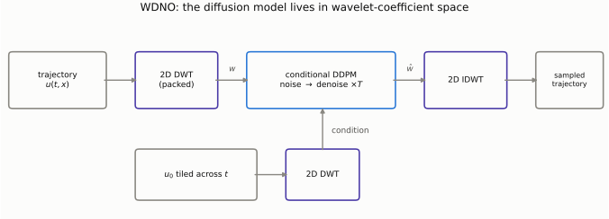
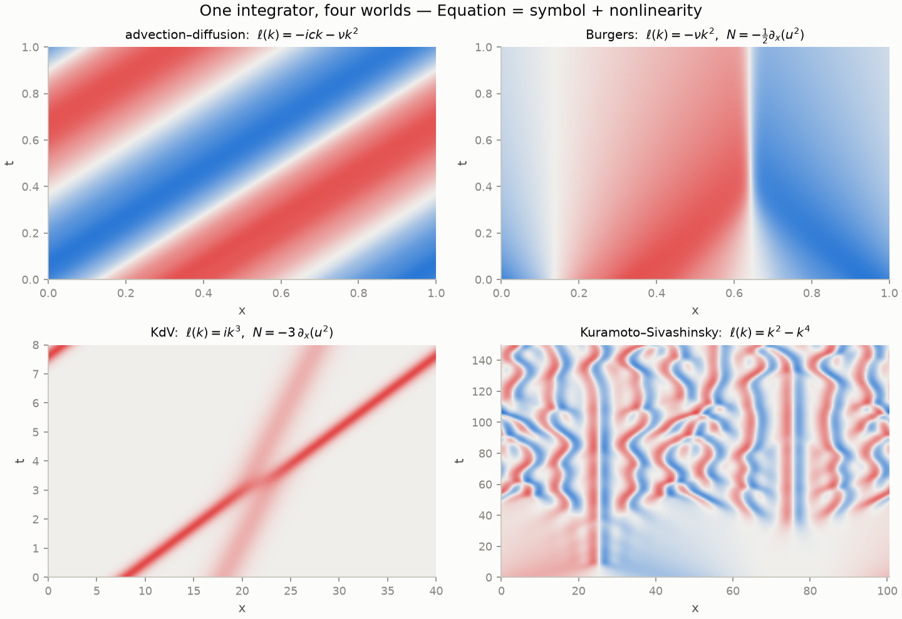
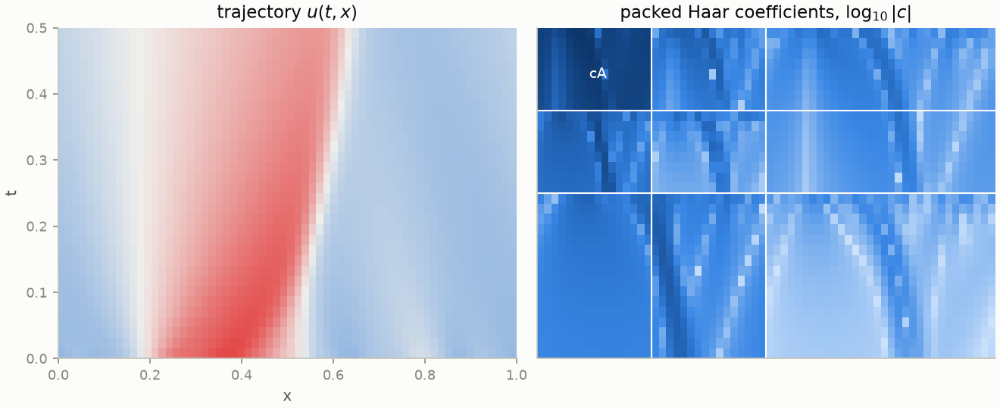
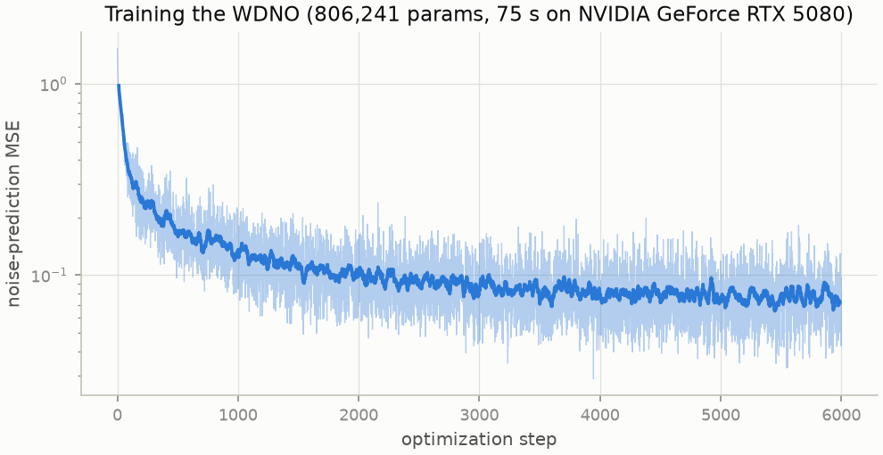
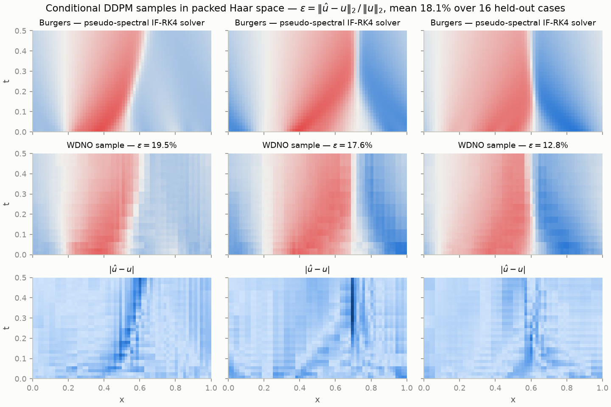
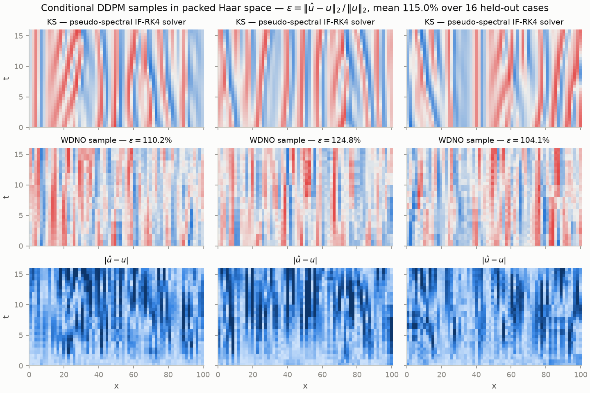
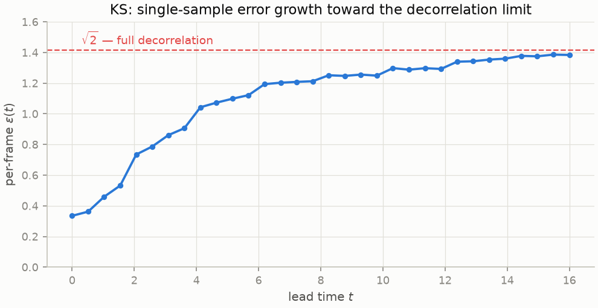

+++
title = "The Generative Sequel: Wavelet Diffusion Neural Operators"
description = "Part 4 of a series on the Fourier transform: from a PDE to a computational problem — operators, symbols, stiffness — and a toy wavelet diffusion neural operator that samples whole Burgers trajectories."
date = 2026-07-07
[taxonomies]
tags = ["math", "fourier", "wavelets", "jax", "machine-learning", "scientific-computing", "diffusion-models"]
+++

_This is part 4 of the series
([part 1](@/posts/post-1-origins/index.md): Euler's formula and Fourier series\;
[part 2](@/posts/post-2-dft-fft/index.md): the DFT, FFT, and spectral methods\;
[part 3](@/posts/post-3-wavelets-wno/index.md): wavelets and a minimal WNO).
Everything is reproducible from
[the repo](https://github.com/MarioDanielPanuco/Fourier-Transform):
`pixi run -e cuda wdno-train`, then `pixi run figs-post4`._

## Where it sits

Part 3 ended with the deterministic operator-learning picture — a table worth
re-drawing, because the subject of this post is the newest addition:

|          | transform              | middle                                    | output                                   |
| -------- | ---------------------- | ----------------------------------------- | ---------------------------------------- |
| FNO      | FFT                    | learned weights on low modes              | one solution field                       |
| WNO      | DWT                    | learned weights on coarse subbands        | one solution field                       |
| **WDNO** | DWT (space _and_ time) | **diffusion model** over all coefficients | a _distribution_ over whole trajectories |

The **Wavelet Diffusion Neural Operator**
([Hu et al., 2024](https://arxiv.org/abs/2412.04833)) stacks two separate upgrades
on the WNO, and it pays to keep them apart:

1. **Regression → generation.** FNO/WNO map an input function to a single point
   estimate, trained with a relative-L2 loss. WDNO instead learns a conditional
   _distribution_ $p\bigl(\mathcal{W}u_{[0,T]} \mid \mathcal{W}a\bigr)$ — a standard
   [DDPM](https://arxiv.org/abs/2006.11239) with a U-Net denoiser — over the full
   space-time trajectory, conditioned on the wavelet transform of the problem data
   $a$ (initial conditions, forcings). Generation is distinct from regression in two ways:
   it provides calibrated samples of chaotic dynamics, and gradient _guidance_, which
   turns the same trained model into a controller.

2. **Physical space → wavelet space.** The diffusion doesn't run on the raw field.
   The whole trajectory $u(t, x)$ is wavelet-transformed jointly in space and time,
   and the DDPM diffuses and denoises the complete coefficient vector. Diffusion models
   are known to smear abrupt changes and struggle with resolution transfer, while
   wavelet coefficients represent discontinuities _sparsely and locally_ — the hard
   content of the signal is concentrated in a few coefficients instead of spread across
   a global basis.



One disambiguation before anything else, because the name invites it: the
"diffusion" in WDNO is the **generative process** — noise gradually removed by a
learned denoiser. WDNO is a solver/controller
architecture, not a method for parabolic PDEs. We validate this claim via the application of WDNOs to non-diffusion, non-parabolic equations: 1D advection (hyperbolic), 1D Burgers (shock-forming), 1D _compressible_
Navier–Stokes, 2D incompressible flow, and the ERA5 weather record. What the method actually wants from a problem is structural:
trajectories on a regular grid, with sharp, localized, multiscale features, e.g, fronts,
shocks, filaments, etc, where a wavelet basis is sparse and a global basis isn't.
On smooth, slowly-varying dynamics it's accuracy is least differentiated from a
plain FNO\; on equations governed by shock-dominated dynamics, WDNOs stand out as the more advantageous method.

## From equation to computation

It's worth outlining the _analytical_ pipeline that
turns an equation into something a computer (or a neural operator) can chew on —
this is the machinery that underlies the generation of every training sample in
parts 3 and 4.

**The physical scenario.** Consider momentum transport in a one-dimensional fluid:
a velocity field $u(t, x)$ on a periodic domain that _advects itself_ (each parcel
is carried along at its own speed, so fast fluid overtakes slow fluid) while
molecular viscosity diffuses the differences away. The simplest mathematical model
of this competition is the **viscous Burgers equation**, the standard 1D caricature
of the Navier–Stokes momentum balance:

$$
\underbrace{\frac{\partial u}{\partial t}}\_{\text{evolution}}
\\;+\\; \underbrace{u\\, \frac{\partial u}{\partial x}}\_{\text{self-advection}}
\\;=\\; \underbrace{\nu\\, \frac{\partial^2 u}{\partial x^2}}\_{\text{viscous smoothing}},
\qquad x \in [0, 1),\\; \nu = 0.01 .
$$

Self-advection steepens smooth profiles into near-discontinuous fronts\; viscosity
arrests the steepening at a width set by $\nu$. That contest is what makes Burgers
the canonical test problem for shock-capturing methods — and for wavelet-based
operators.

The workflow from this model to a computation is three steps.

**Step 1 — split into operator and nonlinearity.** Move everything except the time
derivative to the right-hand side and sort the terms by linearity:

$$
\frac{\partial u}{\partial t}
= \underbrace{\nu\\, \partial_x^2 u}\_{\mathcal{L}u}
\\; \underbrace{-\\; u\\, \partial_x u}\_{\mathcal{N}(u)}
\qquad\text{i.e.}\qquad
u_t = \mathcal{L}u + \mathcal{N}(u),
$$

where $\mathcal{L}$ collects every _linear, constant-coefficient_ term — here
$\mathcal{L} = \nu\\,\partial_x^2$ — and $\mathcal{N}$ is whatever remains, here
$\mathcal{N}(u) = -u\\,u_x$. What kind of object is $\mathcal{L}$? An
**operator on function space**: it eats a function and returns a function, linearly
— a differential operator acting on periodic functions (densely defined on a
[Sobolev subspace](https://en.wikipedia.org/wiki/Sobolev_space) of $L^2$).
An infinite-dimensional matrix, in the same sense that part
2's DFT was a finite one.

**Step 2 — diagonalize the operator.** On a periodic domain the Fourier modes
$e^{ikx}$ are eigenfunctions of _every_ constant-coefficient differential operator
— the only fact this series has ever really used. Each derivative brings down one
factor of $ik$:

$$
\partial_x e^{ikx} = ik\\, e^{ikx}
\quad\Longrightarrow\quad
\mathcal{L} = \sum_j a_j\\, \partial_x^j
\\;\text{ acts as }\\;
\mathcal{L}\\,e^{ikx} = \ell(k)\\,e^{ikx},
\qquad
\ell(k) = \sum_j a_j (ik)^j .
$$

For the Burgers operator the computation is one line — $\mathcal{L} =
\nu\\,\partial_x^2$ has the single coefficient $a_2 = \nu$, so

$$
\ell(k) = \nu\\,(ik)^2 = -\nu k^2
$$

— real and negative: every mode decays, faster with frequency, which is the
spectral fingerprint of diffusion. The function $\ell(k)$ is called the **symbol**
of the operator. In Fourier coordinates, applying $\mathcal{L}$ is multiplication
of coefficient $k$ by the number $\ell(k)$: the operator has become a diagonal
matrix, exactly the move that solved the heat equation in part 1.

**Step 2b — the nonlinearity has no symbol.** The same trick fails on
$\mathcal{N}(u) = -u\\,u_x$: it is not linear, so it has no eigenbasis to share.
Two identities rescue it. First, the product rule rewrites it in _conservative
form_,

$$
u\\, u_x = \tfrac{1}{2}\\, \partial_x\bigl(u^2\bigr)
\quad\Longrightarrow\quad
\mathcal{N}(u) = -\tfrac{1}{2}\\, \partial_x\bigl(u^2\bigr),
$$

reducing the problem to "square the field, then differentiate." Second, each piece
is computed in the domain where it is cheap. Squaring in Fourier coordinates would
be a full convolution of coefficient sequences (part 2's convolution theorem read
in reverse, $\mathcal{O}(n^2)$)\; squaring in physical space is pointwise. So the
**pseudo-spectral** evaluation hops between domains:

$$
\widehat{\mathcal{N}(v)} = -\tfrac{1}{2}\\, ik \cdot
\mathcal{F}\Bigl[\bigl(\mathcal{F}^{-1}\hat{v}\bigr)^2\Bigr] \cdot m(k),
$$

inverse FFT, square, FFT, multiply by $ik$. The mask $m(k)$ is the **2/3 rule**:
the square of an $n$-mode signal contains $2n$ modes, and the unrepresentable half
folds back onto the grid as aliases (part 2's folding ruler)\; zeroing the top
third of the spectrum removes the corruption exactly for a quadratic term. This
five-operation recipe is the entire cost of nonlinearity in a spectral method.

The symbol and the nonlinearity together are all the solver ever needs to know
about the physics — which is why the repo's solver can treat the equation as data:

```python
@dataclass(frozen=True)
class Equation:
    name: str
    linear: Callable[[Grid], Array]              # grid -> l(k): the symbol
    nonlinear: Callable[[Array, Grid], Array] | None

burgers = Equation("burgers", lambda g: -nu * g.k**2, quadratic(-0.5))
kdv     = Equation("kdv",     lambda g: 1j * g.k**3,  quadratic(-3.0))
ks      = Equation("ks",      lambda g: g.k**2 - g.k**4, quadratic(-0.5))
```

| equation             | PDE                                   | symbol $\ell(k)$ | nonlinearity                   |
| -------------------- | ------------------------------------- | ---------------- | ------------------------------ |
| heat                 | $u_t = \nu u_{xx}$                    | $-\nu k^2$       | —                              |
| advection–diffusion  | $u_t + c u_x = \nu u_{xx}$            | $-ick - \nu k^2$ | —                              |
| Burgers              | $u_t + u u_x = \nu u_{xx}$            | $-\nu k^2$       | $-\tfrac{1}{2}\partial_x(u^2)$ |
| KdV                  | $u_t + 6u u_x + u_{xxx} = 0$          | $ik^3$           | $-3\\,\partial_x(u^2)$         |
| Kuramoto–Sivashinsky | $u_t + u u_x + u_{xx} + u_{xxxx} = 0$ | $k^2 - k^4$      | $-\tfrac{1}{2}\partial_x(u^2)$ |

**Step 3 — discretize and integrate.** Sampling $x$ on $n$ grid points truncates
the Fourier series to $n$ modes, and the PDE collapses into a system of ordinary
differential equations, one per coefficient — the
[method of lines](https://en.wikipedia.org/wiki/Method_of_lines). For Burgers:

$$
\frac{d\hat{v}_k}{dt} = -\nu k^2\\, \hat{v}_k
\\;-\\; \tfrac{1}{2}\\, ik\\, \widehat{\bigl(v^2\bigr)}_k ,
\qquad k = 0, \ldots, n/2 .
$$

One practical obstruction remains, and it is visible in the symbol itself:
[**stiffness**](https://en.wikipedia.org/wiki/Stiff_equation). Because $|\ell(k)|$
grows like $k^2$ for diffusion — $k^3$ for KdV's dispersion, $k^4$ for
Kuramoto–Sivashinsky — the highest resolved mode forces any fully explicit
time-stepper into steps of order $\Delta x^p$, absurdly small precisely when the
grid is fine. The remedy is an
[integrating factor](https://en.wikipedia.org/wiki/Exponential_integrator): the
linear part alone has the _exact_ solution $\hat{v}_k(t) = e^{\ell(k) t}\\,
\hat{v}_k(0)$, so a change of variables absorbs the stiff term analytically and
leaves only the benign nonlinear term to be stepped numerically. The repo uses an
integrating-factor RK4\; for a linear equation every stage vanishes and the scheme
degenerates to the exact propagator, which doubles as the solver's self-test
(`python -m ftx.spectral`).

That is the entire classical pipeline: **symbol + nonlinearity + exponential
integrator**. Here it is running four different physical regimes with the same
thirty lines — transport, shock formation, solitons overtaking each other,
spatiotemporal chaos — by swapping nothing but the `Equation` value:



**Posing the learning problem.** A neural operator re-poses this pipeline as data.
The WNO of part 3 learned the _endpoint map_ $u(\cdot, 0) \mapsto u(\cdot, T)$: the
solver generated input–output pairs, and the operator amortized the 500 time-steps
between them into one forward pass. The WDNO changes the target: learn the
_distribution over whole trajectories_ $u(t, x)$, represented in wavelet
coefficients, conditioned on the wavelet transform of what you know (here, the
initial state). Same solver, same data — a different, strictly more ambitious
question asked of it.

## Simulation and control in one model

**Simulation** is conditional sampling: draw wavelet coefficients from the learned
conditional distribution and inverse-transform,

$$
\mathcal{W}u \sim p(\\,\cdot \mid \mathcal{W}a\\,),
\qquad
u = \mathcal{W}^{-1}\bigl(\mathcal{W}u\bigr).
$$

**Control** is the payoff of being generative. Suppose 1D Burgers with a forcing
term $f(t, x)$ that we are free to choose, and a target state $u^{\star}$ to be
reached at time $T$. A standard quadratic objective penalizes both the miss and the
actuation effort:

$$
J = \int_D \bigl| u(T, x) - u^{\star}(x) \bigr|^2\\, dx
\\;+\\; \alpha \int_{[0,T] \times D} \bigl| f(t, x) \bigr|^2\\, dt\\, dx .
$$

Guided sampling folds this objective into generation. Write $x^{(k)}$ for the noisy
wavelet-coefficient iterate at reverse-diffusion step $k$ and $c$ for the
conditioning\; each step subtracts the objective's gradient alongside the learned
score:

$$
x^{(k-1)} = x^{(k)}
\\;-\\; \eta\\,\Bigl(\epsilon_\theta\bigl(x^{(k)}, c, k\bigr)
\\;+\\; \lambda\\, \nabla J\bigl(\hat{x}_0^{(k)}\bigr)\Bigr) + \xi_k ,
$$

where $\epsilon_\theta$ is the trained denoiser, $\hat{x}_0^{(k)}$ is the standard
DDPM estimate of the clean sample at step $k$, $\lambda$ is the guidance weight,
and $\xi_k$ is the sampler's noise. The sampler _is_ the planner: no separate
policy network, no differentiating through a solver. The same weights simulate and
control.

## Multi-resolution training

The paper's second contribution attacks resolution generalization head-on instead
of hoping the operator inherits it. Build training pairs by downsampling —
$(N, N/2), (N/2, N/4), \ldots$, no extra fine-grid solves — and train _two_
diffusion models: a base model at the coarsest grid, and a super-resolution model
for

$$
p\bigl(\mathcal{W}u_{\mathrm{high}} \\;\big|\\; \mathcal{W}u_{\mathrm{low}},\\,
\mathcal{W}a_{\mathrm{high}}\bigr).
$$

At inference, sample coarse, then apply the
super-resolution model as many rungs up as you like — including resolutions never
seen in training. The wavelet representation is what makes the rung-to-rung map
_local_ (each fine coefficient depends on a neighborhood of coarse ones)\; their
ablation shows the same scheme in raw space-time degrades as super-resolution steps
stack.

## What the paper reports

Five systems, against raw-space DDPM, FNO, MWT, CNN, OFormer and others
(numbers transcribed from v3 of the paper — re-verify against the
[released code](https://github.com/AI4Science-WestlakeU/wdno) before quoting):

| system                              | WDNO   | best competitor | note                           |
| ----------------------------------- | ------ | --------------- | ------------------------------ |
| 1D advection, simulation (MSE)      | 2.9e-5 | DDPM 4.2e-5     | smooth — modest gap            |
| 1D Burgers, simulation (MSE)        | 1.4e-4 | DDPM 1.3e-4     | smooth-ish — a wash            |
| 1D compressible Navier–Stokes (MSE) | 0.22   | DDPM 5.52       | **25× — shocks are the story** |
| 2D incompressible fluid (MSE)       | 0.0023 | DDPM 0.016      | 7×                             |
| ERA5 weather (MSE)\*                | 12.83  | FNO 14.39       | real data                      |
| 2D smoke control (objective $J$)    | 0.068  | DDPM 0.312      | **78% less leakage**           |

<small>\* ERA5 is ECMWF's global atmospheric reanalysis (hourly estimates on a
0.25° latitude–longitude grid, 1979–present). The paper uses its **temperature
field**, with the task of predicting the next 20 hours of evolution from the
preceding 12 hours of states.</small>

The pattern is the series' through-line wearing a new coat: where the solution is
smooth, a global basis is fine and wavelets buy little (the Burgers row)\; where the
state carries fronts and shocks, the local basis dominates (the compressible NS
row). Their Fourier-domain ablation — the identical diffusion pipeline with an FFT
in place of the DWT — is "significantly inferior" on the shock-heavy system.

## Crux

[`src/ftx/wdno/`](https://github.com/MarioDanielPanuco/Fourier-Transform) implements
the simulation in a few hundred lines of JAX Python, grown out of
part 3's WNO. The pipeline, per file:

- **`data.py`** — the same pseudo-spectral Burgers solver (now the shared
  `ftx.spectral` module), but keeping the whole rollout: $M$ trajectories of
  shape $(N_t \times N_x)$, where $N_t$ counts saved time frames and $N_x$ is the
  saved spatial resolution. For this post, $M = 2{,}064$ trajectories of shape
  $32 \times 64$.

- **`wavelets2d.py`** — the transform. The 1D Haar DWT is the simplest orthonormal
  wavelet transform: it replaces each adjacent pair of samples by its normalized
  average and difference,

$$
a_i = \frac{u_{2i} + u_{2i+1}}{\sqrt{2}},
\qquad
d_i = \frac{u_{2i} - u_{2i+1}}{\sqrt{2}},
$$

halving the resolution while retaining exact invertibility: $(a, d)$ carries the
same information as $u$, reorganized into a coarse approximation plus the detail
needed to reconstruct it. The 2D transform is separable — apply the 1D transform
along $t$, then along $x$ — so one level yields four subbands: the approximation
(both axes averaged), two mixed subbands (detail in $t$, average in $x$, and vice
versa), and the diagonal detail. Recursing on the approximation for $L$ levels
gives part 3's multiresolution pyramid, now in two dimensions. Two design choices
deserve justification. _Why transform $(t, x)$ jointly?_ Because the structures
that make PDE trajectories hard — a shock line moving through the plane — are
localized in space **and** time together\; 2D wavelet atoms are localized in both
coordinates at every scale, so the shock line touches only a few coefficients per
level. _Why Haar?_ With periodic wrapping, Haar halves each axis exactly (no
boundary padding), so a level-2 decomposition of a $32 \times 64$ trajectory
packs into the classic nested layout of exactly $32 \times 64$ — the denoiser can
be an ordinary image U-Net over the coefficient plane. (The paper uses smoother
biorthogonal bases, `bior2.4`/`bior1.3`\; Haar keeps the toy's shape bookkeeping
trivial at some cost in coefficient sparsity.)



- **`unet.py`** — a small NHWC U-Net (806k parameters): two downsamplings, residual
  blocks with GroupNorm, sinusoidal timestep embeddings.
- **`diffusion.py`** — vanilla DDPM: 300 steps, linear β schedule, noise-prediction
  loss, ancestral sampler under `jax.lax.scan`.
- **`train.py`** — packs every trajectory once, rescales the coefficients, and runs
  standard DDPM training conditioned on the initial state:

```text
# preparation
W    <- dwt2_packed(trajectories)                  # (M, 32, 64) coefficient images
C    <- dwt2_packed(u0 tiled across the Nt frames) # conditioning images
s    <- std(W, axis=0), clipped away from 0        # per-coefficient scale map
W, C <- W / s,  C / s

# training loop
repeat:
    x0, c <- random minibatch from (W, C)
    k     ~  Uniform{0, ..., 299}                  # noise level
    eps   ~  N(0, I)
    xk    <- sqrt(abar_k) * x0 + sqrt(1 - abar_k) * eps
    loss  <- || UNet(xk, c, k) - eps ||^2          # predict the injected noise
    adam update on UNet parameters

# sampling (simulation)
x ~ N(0, I)
for k = 299 down to 0:
    x <- ancestral DDPM step using UNet(x, c, k)
return idwt2_packed(x * s)
```

The per-coefficient normalization (`s` above, equivalently per-subband for the
packed layout) is a consequence of how an orthonormal wavelet transform
distributes energy. The transform is norm-preserving, but it concentrates: a Haar
averaging step maps a locally smooth pair to $a = (u_{2i} + u_{2i+1})/\sqrt{2}
\approx \sqrt{2}\\,u$, a gain of $\sqrt{2}$ per level per axis on the smooth
content of the signal, while each detail coefficient measures a local difference
and is near zero wherever the field is smooth. In this dataset the level-2
approximation block has standard deviation $\approx 1.7$ against $\approx 0.03$
for the finest detail subbands — a $60\times$ disparity in scale. This
concentration is exactly the sparsity that part 3's compression argument exploits,
and it is preserved here: the normalization does not alter the representation,
only the units in which the denoiser sees each coordinate.

The reason those units matter is the noise model. The DDPM forward process adds
noise of a single global scale to every coordinate, so a coefficient's
signal-to-noise ratio at diffusion step $k$ is proportional to its own standard
deviation. With a $60\times$ scale disparity there is no noise level at which both
blocks are usefully corrupted: while the approximation block is still barely
perturbed, the detail subbands — which carry the front's position — are already
indistinguishable from noise, and the training signal for denoising them is
negligible over most of the schedule. Dividing each coefficient by its standard
deviation over the training set gives every coordinate the same schedule\; the
stored map `s` is multiplied back before the inverse transform. The distinction
from compression is the task: compression may discard the small coefficients,
whereas a generative model must reproduce their distribution, and it can only
learn to do so if they are visible to it during training.



Sixteen held-out initial conditions, one DDPM sample each (300 denoising steps, ~2 s
total for all sixteen):



Mean whole-trajectory rel-L2 ≈ **18%**, with the error visibly concentrated along
the moving shock — the sample nails the global transport and diffuses about the
exact front position, which is the honest failure mode for a generative model this
size. Two caveats before comparing that to the WNO's 9.7%: this metric covers the
_whole trajectory_ (32 frames, easy early ones and hard late ones) versus the WNO's
single endpoint\; and one diffusion sample is a draw from a distribution, not a
posterior mean — averaging several samples per input lowers the number.

## Benchmarks

Both operators were benchmarked on the 1D viscous Burgers system above, on one
machine (Ryzen 9800X3D CPU\; RTX 5080 GPU\; JAX on WSL2), via
`pixi run [-e cuda] wno-bench` and `wdno-bench`. All throughputs are measured
after JIT compilation, with results fetched from the device only at the end of
the timed region — they reflect computation, not host–device transfer. One
_training step_ is a full Adam update (forward, backward, parameter update) on
one minibatch\; one _operator evaluation_ is a single forward pass mapping an
initial condition to an endpoint\; one _sampled trajectory_ is 300 sequential
denoiser evaluations.

| quantity                                                             | unit           | CPU   | RTX 5080 | GPU/CPU |
| -------------------------------------------------------------------- | -------------- | ----- | -------- | ------- |
| WNO training (batch 32, $n = 256$)                                    | steps/s        | 35.8  | 199.2    | 5.6×    |
| WNO inference (batch 128)                                             | evaluations/s  | 2,954 | 116,735  | 40×     |
| WDNO U-Net training (batch 16, $32 \times 64$ coefficient images)     | steps/s        | 9.5   | 183.9    | 19×     |
| WDNO sampling (batch 16, 300 denoiser calls each)                     | trajectories/s | 2.0   | 3.8      | 1.9×    |

End-to-end wall time deviates from these rates in one systematic way. The
training script logs the loss every step, which transfers a scalar to host and
stalls the GPU pipeline: the WNO's 12,000 steps take 104 s on the GPU (about 60 s
of computation at the benchmarked rate plus about 44 s of synchronization
stalls) versus 339 s on the CPU, which is compute-bound and unaffected by the
transfers. This is also why every published run now records
`jax.default_backend()` in `metrics.json`: device attribution belongs in the
artifact, not in a figure caption.

The spread of speedups — 1.9× to 40× on the same hardware — is explained by
arithmetic intensity and kernel count rather than model size. A WNO layer
executes dozens of small kernels per step (sequential DWT filter convolutions,
per-subband einsums), each doing little arithmetic per launch, so training is
launch-latency-bound — a regime WSL2's added launch overhead makes worse\;
batched inference amortizes those launches over 128 inputs at once and reaches
40×. The WDNO's U-Net spends its time in wide convolutions with substantial
arithmetic per kernel, hence 19× in training\; its sampling gains only 1.9×
because 300 denoiser calls are inherently sequential and a batch of 16 small
images does not saturate the device — larger sampling batches recover most of
the difference.

These numbers are specific to a small 1D system. Two-dimensional fields (the
paper's smoke-control setting) increase the work per kernel and widen every GPU
margin\; deeper wavelet decompositions or longer filters do the opposite,
adding small sequential kernels. Dataset generation with the spectral solver is
sequential across time steps in the same way sampling is, and parallelizes on
the GPU only across initial conditions (`vmap`). Where each equation in the
roadmap below lands on this spectrum is measured as it is added, alongside
accuracy.

## A second equation: Kuramoto–Sivashinsky

The equation-agnostic solver makes a second experiment inexpensive, so here is the
template — scenario, model, analysis, computation, results — run once more, on a
system chosen to stress the opposite regime from Burgers: not a single front
sharpening under dissipation, but sustained spatiotemporal chaos.

**Scenario and model.** The
[Kuramoto–Sivashinsky equation](https://en.wikipedia.org/wiki/Kuramoto%E2%80%93Sivashinsky_equation)
arises as the normal form of several instability-driven systems — flame-front
wrinkling, thin liquid films, drift waves in plasmas:

$$
\frac{\partial u}{\partial t}
\\;+\\; u\\,\frac{\partial u}{\partial x}
\\;+\\; \frac{\partial^2 u}{\partial x^2}
\\;+\\; \frac{\partial^4 u}{\partial x^4}
= 0 .
$$

**Analysis.** Splitting as before, the nonlinearity is the same Burgers term
$\mathcal{N}(u) = -\tfrac{1}{2}\partial_x(u^2)$, and the linear operator
$\mathcal{L} = -\partial_x^2 - \partial_x^4$ has symbol

$$
\ell(k) = -(ik)^2 - (ik)^4 = k^2 - k^4 .
$$

The sign structure is the whole story of this equation. For $0 < k < 1$ the symbol
is _positive_: long modes grow — the $-\partial_x^2$ term is an _anti_-diffusion,
injecting energy (the instability). For $k > 1$ the $k^4$ hyperdiffusion dominates
and short modes are damped hard. Neither behavior alone is interesting\; the
nonlinearity couples them, transferring energy from the unstable band into the
damped band, and the balance is deterministic chaos. On a domain of length $L$ the
unstable modes are $k_j = 2\pi j / L < 1$, so $L = 32\pi$ admits roughly sixteen of
them — comfortably chaotic. The $k^4$ stiffness is also the reason the integrating
factor earns its keep here: an explicit stepper would need $\Delta t \sim \Delta
x^4$.

**Computation.** `pixi run -e cuda wdno-data-ks wdno-train-ks`. Random smooth
initial conditions are integrated for a burn-in of 40 time units first, so every
recorded trajectory starts on the chaotic attractor rather than in the smooth
transient\; the dataset is then $2{,}064$ trajectories of 32 frames over $t \in
[0, 16]$ at 64 saved grid points ($\Delta t = 0.05$, solver at $n = 256$). The
model, packing, normalization, and training schedule are identical to the Burgers
case — same U-Net, same 6,000 steps — and train in 62 s on the RTX 5080.

**Results.** The conditional samples reproduce the attractor's texture — cellular
structures of the correct width, merging and splitting — but they do not track the
reference trajectory:



The mean whole-trajectory rel-L2 is **115%**, and the per-frame error curve shows
why this is a property of the problem as much as of the model:



For two fields with equal energy and no correlation, $\varepsilon =
\Vert\hat{u} - u\Vert_2 / \Vert u\Vert_2 \to \sqrt{2}$\; the samples reach that
limit by mid-trajectory. Chaos guarantees some version of this curve for _every_
method: a positive Lyapunov exponent amplifies any initial discrepancy
exponentially, and the sample starts with a 34% reconstruction error at frame 0
(the toy's conditioning is imperfect), so pointwise agreement is lost within a few
time units. This is the regime where the generative framing stops being a luxury:
past the predictability horizon the only meaningful questions are distributional.
On that score the toy is partially successful — the sampled fields carry 92% of
the true standard deviation, but their late-time spatial spectrum is distorted,
over-weighting the largest cells (modes 4–7 carry 2–3× the true energy) and
under-weighting the mid-band (modes 8–13 at 0.3–0.5×). A model of this size
reproduces the attractor's scale and texture\; matching its spectrum is the
obvious next increment, and the per-frame curve gives the baseline to beat.

## Where to take it

The point of making the solver equation-agnostic is that every next experiment is
now a few lines: pass a different symbol and nonlinearity, regenerate trajectories,
retrain — Kuramoto–Sivashinsky above was exactly that. A roadmap in rough order of
what each problem would prove:

- **KdV** — solitons and dispersive shocks\; sharp coherent structures that travel
  and interact, ideal for validating super-resolution on localized features.
- **Kuramoto–Sivashinsky, done properly** — the first pass above leaves a concrete
  target: match the attractor's late-time spectrum, and evaluate distributionally
  (spectra, structure functions) rather than by trajectory error.
- **Compressible Euler (Sod tube)** — genuine discontinuities: contacts,
  rarefactions, shocks\; the regime where the paper's 25× lives.
- **FitzHugh–Nagumo** — traveling excitation waves with steep fronts\; the guided
  control story maps naturally onto spiral-wave suppression (defibrillation).
- **Nonlinear Schrödinger** — optical solitons and rogue-wave statistics\; the
  signals crossover.

All the listed 1D equations drop into `ftx.spectral` as a symbol plus a
nonlinearity, and each addition follows the template this post ran twice —
physical scenario → PDE → symbol and nonlinearity → discretization → trained
operator → results. What's missing versus the paper — and the natural next build
— is **control**: add a forcing channel to the dataset and the guided update
above\; 1D Burgers control is exactly the paper's first benchmark.

The through-line of the whole series, one last time: _find the basis that makes
your operator simple, act there, come back._ Euler's formula supplied the basis\;
the FFT made the round trip cheap\; wavelets rebuilt the basis for a world with
edges\; neural operators learned the middle from data\; and the WDNO makes the
middle a distribution you can sample and steer.

### Further reading

- Hu et al., ["Wavelet Diffusion Neural Operator"](https://arxiv.org/abs/2412.04833)
  (2024) — the paper this post follows\; [code](https://github.com/AI4Science-WestlakeU/wdno).
- Ho, Jain & Abbeel, ["Denoising Diffusion Probabilistic Models"](https://arxiv.org/abs/2006.11239)
  (2020) — the DDPM machinery used verbatim here.
- Kovachki et al., ["Neural Operator: Learning Maps Between Function Spaces"](https://arxiv.org/abs/2108.08481)
  (2021) — the general theory behind parts 3 and 4.
- Kassam & Trefethen, ["Fourth-order time-stepping for stiff PDEs"](https://doi.org/10.1137/S1064827502410633)
  (2005) — the classic on exponential integrators for exactly the KdV/KS setups above.
- Mallat, _A Wavelet Tour of Signal Processing_ — still the reference for everything
  the DWT does here.
