+++
title = "The Generative Sequel: Wavelet Diffusion Neural Operators"
description = "Part 4 of a series on the Fourier transform: from a PDE to a computational problem — operators, symbols, stiffness — and a minimal wavelet diffusion neural operator that samples whole Burgers trajectories."
date = 2026-07-07
draft = true
[taxonomies]
tags = ["math", "fourier", "wavelets", "jax", "machine-learning", "scientific-computing", "diffusion-models"]
+++

_This is part 4 of the series
([part 1](@/posts/post-1-origins/index.md): Euler's formula and Fourier series\;
[part 2](@/posts/post-2-dft-fft/index.md): the DFT, FFT, and spectral methods\;
[part 3](@/posts/post-3-wavelets-wno/index.md): wavelets and a minimal WNO).
Everything is reproducible from
[the repo](https://github.com/MarioDanielPanuco/FFT-and-Wavelets):
`pixi run -e cuda wdno-train`, then `pixi run figs-post4`. Released alongside
this post: a
[companion notebook](https://github.com/MarioDanielPanuco/FFT-and-Wavelets/blob/main/lab/wdno-design-and-training.qmd)
that tours the implementation cell by cell._

## Where it sits

Part 3 ended with the deterministic operator-learning picture — a table worth
re-drawing, because the subject of this post is the newest addition:

|          | transform              | middle                                    | output                                   |
| -------- | ---------------------- | ----------------------------------------- | ---------------------------------------- |
| FNO      | FFT                    | learned weights on low modes              | one solution field                       |
| WNO      | DWT                    | learned weights on coarse subbands        | one solution field                       |
| **WDNO** | DWT (space _and_ time) | **diffusion model** over all coefficients | a _distribution_ over whole trajectories |

The **Wavelet Diffusion Neural Operator**
([Hu et al., 2024](https://arxiv.org/abs/2412.04833)) stacks two separate upgrades
on the WNO. For sake of the article, it pays to keep them part:

1. **Regression → generation.** FNO/WNO map an input function to a single point
   estimate, trained with a relative-L2 loss. WDNO instead learns a conditional
   _distribution_ $p\bigl(\mathcal{W}u_{[0,T]} \mid \mathcal{W}a\bigr)$ — a standard
   [DDPM](https://arxiv.org/abs/2006.11239) with a U-Net denoiser — over the full
   space-time trajectory, conditioned on the wavelet transform of the problem data
   $a$ (initial conditions, forcings). Generation buys two things a point estimate
   cannot: calibrated samples of chaotic dynamics, and gradient _guidance_, which
   turns the same trained model into a controller.

2. **Physical space → wavelet space.** The diffusion doesn't run on the raw field.
   The whole trajectory $u(t, x)$ is wavelet-transformed jointly in space $x$ and time $t$,
   and the DDPM diffuses and denoises the complete coefficient vector. Diffusion models
   are known to smear abrupt changes and struggle with resolution transfer
   ([Hu et al., 2024](https://arxiv.org/abs/2412.04833), the paper's own motivating premise), while
   wavelet coefficients represent discontinuities _sparsely and locally_ — the hard
   content of the signal is concentrated in a few coefficients instead of spread across
   a global basis.

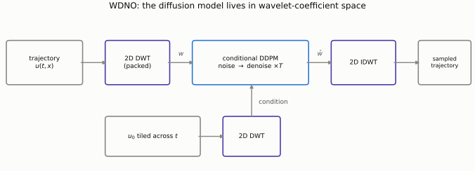

One disambiguation before anything else, because the name invites it: the
"diffusion" in WDNO is the **generative process** — noise gradually removed by a
learned denoiser **DDPM**. WDNO is a solver/controller architecture,
not a method for parabolic PDEs, and the paper's benchmarks are mostly
non-parabolic: advection, Burgers, _compressible_ Navier–Stokes, 2D
incompressible flow, the ERA5 weather temperature layer dataset. What the method wants from a
problem is structural: trajectories on a regular grid, with sharp, localized,
multiscale features — fronts, shocks, filaments — where a wavelet basis is
sparse and a global basis isn't. On smooth, slowly-varying dynamics its accuracy
is least differentiated from a plain FNO\; on shock-dominated dynamics the
margin is widest.

## From equation to computation

Before the learned operator, the classical one: this section walks the
_analytical_ pipeline that turns an equation into a prepared computation for my ftx codebase
— the same pipeline the neural operator will later amortize.

**The physical scenario.** Consider momentum transport in a 1D fluid:
a velocity field $u(t, x)$ on a periodic domain that _advects itself_ (each parcel
is carried along at its own speed, so fast fluid overtakes slow fluid) while
molecular viscosity diffuses the differences away. The simplest mathematical model
of this competition is the **viscous Burgers equation**, the standard 1D caricature
of the [Navier–Stokes](https://en.wikipedia.org/wiki/Navier%E2%80%93Stokes_equations)
momentum balance:

$$
\underbrace{\frac{\partial u}{\partial t}}\_{\text{evolution}}
\\;+\\; \underbrace{u\\, \frac{\partial u}{\partial x}}\_{\text{self-advection}}
\\;=\\; \underbrace{\nu\\, \frac{\partial^2 u}{\partial x^2}}\_{\text{viscous smoothing}},
\qquad x \in [0, 1),\\; \nu = 0.01 .
$$

Self-advection steepens smooth profiles into near-discontinuous fronts\; viscosity
arrests the steepening at a width set by $\nu$.

The workflow from this model to a computation is three steps.

**Step 1 — split into operator and nonlinearity.** Move everything except the time
derivative to the right-hand side and sort the terms by linearity:

$$
\frac{\partial u}{\partial t}
= \underbrace{\nu\\, \partial_x^2 u}\_{\mathcal{L}u}
\\; \underbrace{-\\; u\\, \partial_x u}\_{\mathcal{N}(u)}
\qquad\text{i.e.}\qquad
u_t = \mathcal{L}u + \mathcal{N}(u),
$$

where $\mathcal{L}$ collects every _linear, constant-coefficient_ term — here
$\mathcal{L} = \nu\\,\partial_x^2$ — and $\mathcal{N}$ is whatever remains, here
$\mathcal{N}(u) = -u\\,u_x$. What kind of object is $\mathcal{L}$? An
**operator on function space**: it eats a function and returns a function, linearly
— a differential operator acting on periodic functions (densely defined on a
[Sobolev subspace](https://en.wikipedia.org/wiki/Sobolev_space) of $L^2$).
An infinite-dimensional matrix, in the same sense that part
2's DFT was a finite one.

**Step 2 — diagonalize the operator.** On a periodic domain the Fourier modes
$e^{ikx}$ are eigenfunctions of _every_ constant-coefficient differential operator
— the only fact this series has ever really used. Each derivative brings down one
factor of $ik$:

$$
\partial_x e^{ikx} = ik\\, e^{ikx}
\quad\Longrightarrow\quad
\mathcal{L} = \sum_j a_j\\, \partial_x^j
\\;\text{ acts as }\\;
\mathcal{L}\\,e^{ikx} = \ell(k)\\,e^{ikx},
\qquad
\ell(k) = \sum_j a_j (ik)^j .
$$

For the Burgers operator the computation is one line — $\mathcal{L} =
\nu\\,\partial_x^2$ has the single coefficient $a_2 = \nu$, so

$$
\ell(k) = \nu\\,(ik)^2 = -\nu k^2
$$

— real and negative: every mode decays, faster with frequency, which is the
spectral fingerprint of diffusion. The function $\ell(k)$ is called the **symbol**
of the operator. In Fourier coordinates, applying $\mathcal{L}$ is multiplication
of coefficient $k$ by the number $\ell(k)$: the operator has become a diagonal
matrix, exactly the move that solved the heat equation in part 1.

**Step 2b — the nonlinearity has no symbol.** The same trick fails on
$\mathcal{N}(u) = -u\\,u_x$: it is not linear, so it has no eigenbasis to share.
Two identities rescue it. First, the product rule rewrites it in _conservative
form_,

$$
u\\, u_x = \tfrac{1}{2}\\, \partial_x\bigl(u^2\bigr)
\quad\Longrightarrow\quad
\mathcal{N}(u) = -\tfrac{1}{2}\\, \partial_x\bigl(u^2\bigr),
$$

reducing the problem to "square the field, then differentiate." Second, each piece
is computed in the domain where it is cheap. Squaring in Fourier coordinates would
be a full convolution of coefficient sequences (part 2's convolution theorem read
in reverse, $\mathcal{O}(n^2)$)\; squaring in physical space is pointwise. So the
**pseudo-spectral** evaluation hops between domains:

$$
\widehat{\mathcal{N}(v)} = -\tfrac{1}{2}\\, ik \cdot
\mathcal{F}\Bigl[\bigl(\mathcal{F}^{-1}\hat{v}\bigr)^2\Bigr] \cdot m(k),
$$

inverse FFT, square, FFT, multiply by $ik$. The mask $m(k)$ is the **2/3 rule**:
the square of an $n$-mode signal contains $2n$ modes, and the unrepresentable half
folds back onto the grid as aliases (part 2's folding ruler)\; zeroing the top
third of the spectrum removes the corruption exactly for a quadratic term
([Orszag, 1971](https://doi.org/10.1175/1520-0469%281971%29028%3C1074:OTEOAI%3E2.0.CO;2)). This
five-operation recipe is the entire cost of nonlinearity in a spectral method.

The symbol and the nonlinearity together are all the solver ever needs to know
about the physics — which is why the repo's solver can treat the equation as data:

```python
@dataclass(frozen=True)
class Equation:
    name: str
    linear: Callable[[Grid], Array]              # grid -> l(k): the symbol
    nonlinear: Callable[[Array, Grid], Array] | None

burgers = Equation("burgers", lambda g: -nu * g.k**2, quadratic(-0.5))
kdv     = Equation("kdv",     lambda g: 1j * g.k**3,  quadratic(-3.0))
ks      = Equation("ks",      lambda g: g.k**2 - g.k**4, quadratic(-0.5))
```

| equation             | PDE                                   | symbol $\ell(k)$ | nonlinearity                   |
| -------------------- | ------------------------------------- | ---------------- | ------------------------------ |
| heat                 | $u_t = \nu u_{xx}$                    | $-\nu k^2$       | —                              |
| advection–diffusion  | $u_t + c u_x = \nu u_{xx}$            | $-ick - \nu k^2$ | —                              |
| Burgers              | $u_t + u u_x = \nu u_{xx}$            | $-\nu k^2$       | $-\tfrac{1}{2}\partial_x(u^2)$ |
| KdV                  | $u_t + 6u u_x + u_{xxx} = 0$          | $ik^3$           | $-3\\,\partial_x(u^2)$         |
| Kuramoto–Sivashinsky | $u_t + u u_x + u_{xx} + u_{xxxx} = 0$ | $k^2 - k^4$      | $-\tfrac{1}{2}\partial_x(u^2)$ |

**Step 3 — discretize and integrate.** Sampling $x$ on $n$ grid points truncates
the Fourier series to $n$ modes, and the PDE collapses into a system of ordinary
differential equations, one per coefficient — the
[method of lines](https://en.wikipedia.org/wiki/Method_of_lines). For Burgers:

$$
\frac{d\hat{v}_k}{dt} = -\nu k^2\\, \hat{v}_k
\\;-\\; \tfrac{1}{2}\\, ik\\, \widehat{\bigl(v^2\bigr)}_k ,
\qquad k = 0, \ldots, n/2 .
$$

One practical obstruction remains, and it is visible in the symbol itself:
[**stiffness**](https://en.wikipedia.org/wiki/Stiff_equation). Because $|\ell(k)|$
grows like $k^2$ for diffusion — $k^3$ for KdV's dispersion, $k^4$ for
Kuramoto–Sivashinsky — the highest resolved mode forces any fully explicit
time-stepper into steps of order $\Delta x^p$, absurdly small precisely when the
grid is fine. The remedy is an
[integrating factor](https://en.wikipedia.org/wiki/Exponential_integrator): the
linear part alone has the _exact_ solution $\hat{v}_k(t) = e^{\ell(k) t}\\,
\hat{v}_k(0)$, so a change of variables absorbs the stiff term analytically and
leaves only the benign nonlinear term to be stepped numerically. The repo uses an
integrating-factor RK4\; for a linear equation every stage vanishes and the scheme
degenerates to the exact propagator, which doubles as the solver's self-test
(`python -m ftx.spectral`).

That is the entire classical pipeline: **symbol + nonlinearity + exponential
integrator**. Here it is running four different physical regimes with the same
thirty lines — transport, shock formation, solitons overtaking each other,
spatiotemporal chaos — by swapping nothing but the `Equation` value:

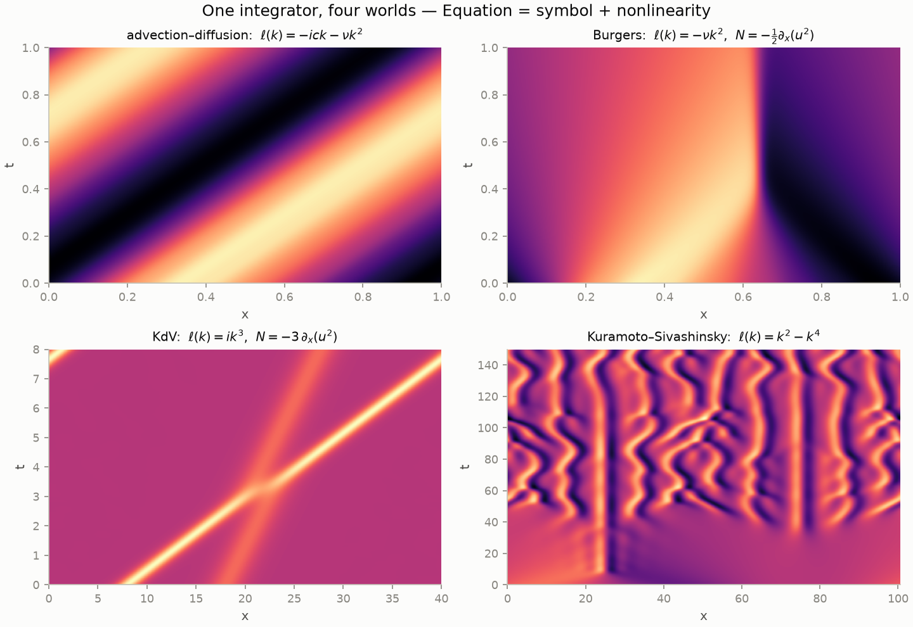

### Convergence and stability, analytically

Everything downstream treats this solver as ground truth, so the pipeline owes
an account of its own error — where it converges, at what rate, and when it is
stable. The scheme has exactly three error sources, and each has a classical
analysis.

All solver-side computation in this post are performed in **double precision**: float64
solves against float64 references, norms accumulated in float64,
trajectories saved as float64. Single-precision "convergence floors" measure
the arithmetic, not the discretization. The float32 boundary sits
where deep learning live: trajectories are cast to
float32 at load, and training and sampling run there. Both placements of the
boundary were measured rather than assumed. Retraining every run of record
on the float64-regenerated datasets changes no reported metric beyond the
fourth decimal\; and a control that trains fully in float64 — at 5–12× the
step time on a consumer GPU, whose fp64 throughput is 1/64 of fp32 by design
— shifts results by no more than reseeding does (enabling x64 changes JAX's
random streams, so that comparison is config-identical, not draw-identical).
The solver's truncation error at the dataset grids is $10^{-13}$–$10^{-6}$,
the model's error $10^{-1}$.

**Spatial truncation.** Sampling on $n$ points truncates the Fourier series at
wavenumber $\sim n/2$, and the interpolation error is bounded by the discarded
tail of the spectrum — so the convergence _rate_ is a property of the
solution's smoothness, not of the scheme. A solution with $p$ derivatives gives
an $O(n^{-p})$ tail\; the smooth dissipative solutions here decay
_geometrically_ in $k$, which is the celebrated
[spectral accuracy](https://epubs.siam.org/doi/book/10.1137/1.9780898719598):
every doubling of $n$ multiplies the error by a constant _in the exponent_.
Dissipation does the work — Burgers damps mode $k$ by $e^{-\nu k^2 t}$ and
Kuramoto–Sivashinsky by roughly $e^{-k^4 t}$ — so once the grid reaches the
dissipation scale, truncation error dives below single-precision arithmetic.
That is not a hypothetical: measured in double precision, the solution energy
beyond the $n = 256$ grid's retained band is $\sim 10^{-14}$ of the total
(Burgers), and the dataset's $n = 256$ solver grid sits at rel-L2
$7 \times 10^{-13}$ from a fine-grid float64 reference for Burgers
($T = 0.5$) and $\sim 9 \times 10^{-7}$ for KS across its whole horizon. Here
is the full picture — both equations, both precisions, identical continuum
initial conditions synthesized exactly on every grid (on-attractor states for
KS, burned in on the reference grid), all comparisons in float64:

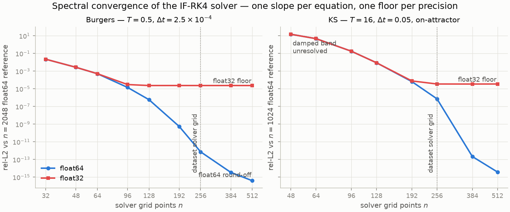

<small>Mean rel-L2 over eight initial conditions. Burgers: $T = 0.5$,
$\Delta t = 2.5 \times 10^{-4}$, reference $n = 2048$. KS: $T = 16$ (the
dataset horizon), $\Delta t = 0.05$ (the dataset step), reference $n = 1024$.
Reproduce: `scripts/sweep_burgers_x64_refinement.py`,
`scripts/sweep_ks_x64_refinement.py`.</small>

In double precision the Burgers error falls geometrically —
$2 \times 10^{-2}$ at $n = 32$ to $6 \times 10^{-10}$ at $n = 192$, roughly
three orders of magnitude per grid increment, the straight-line signature of
spectral accuracy on a log axis — until it lands on the float64 round-off
floor of $\sim 4 \times 10^{-16}$ by $n = 512$. KS repeats the anatomy with
one instructive feature at each end. Below $n \approx 96$ the grid cannot
hold the damped band that receives the cascade's energy, and the error
saturates catastrophically — at $n = 48$ the coarse run carries $15\times$
the reference amplitude, because the unstable band injects energy the
truncated spectrum has nowhere to dissipate. And the drop from $n = 256$
($7 \times 10^{-7}$) to $n = 384$ ($2 \times 10^{-13}$) is six orders of
magnitude in a single refinement: the attractor's spectrum decays
exponentially past the dissipation scale, and the retained band crosses it.
In both equations the float32 solver rides the _same_ curve — until
$n \approx 96$ (Burgers) or $192$ (KS) — then peels off onto its accumulation
floor at $2$–$4 \times 10^{-5}$. Same slope, two floors: the convergence rate
belongs to the discretization, the floor to the arithmetic.

**Time discretization.** The integrating factor is a change of variables
$w = e^{-\ell t}\\, \hat{v}$ that solves the linear term exactly, so RK4's
$O(\Delta t^4)$ global error applies only to the slow nonlinear dynamics — the
stiff symbol never enters the error constant. That is the entire trade: an
explicit stepper applied directly would pay $\Delta t \sim \Delta x^4$ for
Kuramoto–Sivashinsky's $k^4$\; the exponential integrator pays nothing for it
([Kassam & Trefethen, 2005](https://doi.org/10.1137/S1064827502410633)). The
degenerate case doubles as the correctness test: with no nonlinearity the
stepper _is_ the exact propagator, which is what `python -m ftx.spectral`
asserts against closed-form solutions.

**Stability, à la von Neumann.**
[Von Neumann analysis](https://en.wikipedia.org/wiki/Von_Neumann_stability_analysis)
is the workhorse stability test for constant-coefficient schemes, and the
recipe is three moves (following
[Venturi's AM 213B lecture notes, ch. 10](https://web.archive.org/web/20250327044646/https://venturi.soe.ucsc.edu/sites/default/files/CHAPTER_10_Numerical_methods_for_the_advection_equation_0.pdf)):
freeze any variable coefficients, insert a single Fourier mode

$$
u_j^{(m)} = G^m\\, e^{ik x_j}
$$

— one mode suffices, because the frozen-coefficient problem is linear and
diagonal in $k$ — read off the per-step multiplier $G(k)$, the
**amplification factor**, and demand

$$
|G(k)| \\;\le\\; 1 + C\\,\Delta t
\qquad \text{for every retained } k .
$$

The $C\\,\Delta t$ slack is there so that _physical_ growth is not
misdiagnosed as numerical instability — a solution allowed to grow like
$e^{Ct}$ compounds to a bounded factor over any fixed horizon, whereas a
scheme-made instability blows up as the grid refines.

The classic warm-up shows the test's teeth. Discretize pure advection
$u_t + c\\,u_x = 0$ with forward Euler in time and centered differences in
space\; the substitution collapses the scheme to

$$
G(k) = 1 - i\\, \frac{c\\,\Delta t}{\Delta x}\\, \sin(k\\,\Delta x)
\quad\Longrightarrow\quad
|G(k)|^2 = 1 + \frac{c^2 \Delta t^2}{\Delta x^2}\\, \sin^2(k\\,\Delta x)
\\;\ge\\; 1 ,
$$

strictly above one for almost every mode at _every_ finite $\Delta t$: the
obvious scheme is useless in practice. Averaging the neighbors
(Lax–Friedrichs) or biasing the stencil upstream (upwind) repairs it, at the
price of the prototypical
[CFL condition](https://en.wikipedia.org/wiki/Courant%E2%80%93Friedrichs%E2%80%93Lewy_condition)
$|c|\\,\Delta t / \Delta x \le 1$ — the Courant number, the statement that
the numerical domain of dependence must contain the physical one.

Now the same substitution on this post's actual scheme. Linearizing the
advective term $u u_x$ about a frozen speed $c$ (worst case $c = \max|u|$),
one IF-RK4 step multiplies mode $k$ by the composite factor

$$
G(k) = e^{\ell(k)\\, \Delta t} \cdot R(-ick\\, \Delta t),
\qquad
R(z) = 1 + z + \tfrac{z^2}{2} + \tfrac{z^3}{6} + \tfrac{z^4}{24} .
$$

The two factors give two verdicts. The exponential factor is the linear
physics handled exactly: $|e^{\ell \Delta t}| \le 1$ whenever
$\mathrm{Re}\\, \ell \le 0$, with **no condition on $\Delta t$** — the
stiffness constraint is gone by construction. (For KS the band $0 < k < 1$
has $|G| > 1$ — but bounded by $e^{\ell(k)\Delta t} \le 1 + C\\,\Delta t$
with $C = \max_k \ell(k) = 1/4$, which is exactly the physical growth the
von Neumann condition's slack term exists to admit: the instability the
equation is _about_, not a numerical artifact.) The polynomial factor is RK4's stability function, and on
the imaginary axis — where pure advection places its eigenvalues — its modulus
obeys an exact identity, two lines of expansion:

$$
|R(i\theta)|^2 = 1 \\;-\\; \frac{\theta^6}{72} \\;+\\; \frac{\theta^8}{576},
$$

so $|R(i\theta)| \le 1$ precisely when $\theta^2 \le 8$. That is the advective
[CFL condition](https://en.wikipedia.org/wiki/Courant%E2%80%93Friedrichs%E2%80%93Lewy_condition)
of this scheme:

$$
\Delta t \\;\le\\; \frac{2\sqrt{2}}{\max|u| \cdot k\_{\max}},
$$

with $k\_{\max}$ the largest wavenumber the dealiasing mask retains. The
datasets sit comfortably inside it: Burgers at $n = 256$,
$\Delta t = 10^{-3}$, $\max|u| \approx 1.2$ gives $\theta \approx 0.64$, a
4.4× margin\; KS at $n = 256$, $\Delta t = 0.05$, $\max|u| \approx 3.3$ gives
$\theta \approx 0.9$, a 3× margin.

The refinement studies below push this bound deliberately, and the result is
instructive. At $n = 1024$, Burgers reaches $\theta \approx 2.6$ — inside,
thinly — while KS reaches $\theta \approx 3.5$, nominally _outside_ the
interval, yet the runs are measurably stable and bounded over the full
horizon. The resolution is the composite factor that the headline CFL throws
away: near the dealiased edge, exactly where the advective factor turns
marginal, the exponential factor is $e^{-\nu k^2 \Delta t} \approx e^{-46}$
for Burgers and $e^{(k^2 - k^4)\Delta t} \approx e^{-10^4}$ for KS — the modes
that violate the advective bound are annihilated by their own damping at every
step. The frozen-coefficient CFL is the sharp constraint only where the linear
part is neutral\; the honest per-mode statement is the product $|G(k)|$, and it
sits below one everywhere the spectrum actually holds energy.

**Aliasing.** The third error source was dispatched inside the pipeline
itself: the 2/3-rule mask makes the quadratic product alias-free, and because
the mask is applied to the nonlinearity's _output_ at every stage, band-limited
initial data stays band-limited by induction — the dealiasing is exact, not an
approximation that improves with $n$.

The practical summary the rest of this post relies on: at these parameters the
generator is converged past single precision — refining its grid moves the
data by arithmetic noise, as the refinement studies below measure directly —
so the error bars in the learning experiments belong to the model, not to the
truth it is trained against.

**Posing the learning problem.** A neural operator re-poses this pipeline as data.
The WNO of part 3 learned the _endpoint map_ $u(\cdot, 0) \mapsto u(\cdot, T)$: the
solver generated input–output pairs, and the operator amortized the 500 time-steps
between them into one forward pass. The WDNO changes the target: learn the
_distribution over whole trajectories_ $u(t, x)$, represented in wavelet
coefficients, conditioned on the wavelet transform of what you know (here, the
initial state). Same solver, same data — a different, strictly more ambitious
question asked of it.

## Simulation and control in one model

**Simulation** is conditional sampling: draw wavelet coefficients from the learned
conditional distribution and inverse-transform,

$$
\mathcal{W}u \sim p(\\,\cdot \mid \mathcal{W}a\\,),
\qquad
u = \mathcal{W}^{-1}\bigl(\mathcal{W}u\bigr).
$$

**Control** is the payoff of being generative. Suppose 1D Burgers with a forcing
term $f(t, x)$ that we are free to choose, and a target state $u^{\star}$ to be
reached at time $T$. A standard quadratic objective penalizes both the miss and the
actuation effort:

$$
J = \int_D \bigl| u(T, x) - u^{\star}(x) \bigr|^2\\, dx
\\;+\\; \alpha \int_{[0,T] \times D} \bigl| f(t, x) \bigr|^2\\, dt\\, dx .
$$

Guided sampling folds this objective into generation. Write $x^{(k)}$ for the noisy
wavelet-coefficient iterate at reverse-diffusion step $k$ and $c$ for the
conditioning\; each step subtracts the objective's gradient alongside the learned
score:

$$
x^{(k-1)} = x^{(k)}
\\;-\\; \eta\\,\Bigl(\epsilon_\theta\bigl(x^{(k)}, c, k\bigr)
\\;+\\; \lambda\\, \nabla J\bigl(\hat{x}_0^{(k)}\bigr)\Bigr) + \xi_k ,
$$

where the first term inside the parentheses is the trained denoiser's noise
prediction, the gradient is evaluated at the standard DDPM estimate of the clean
sample at step $k$, $\lambda$ is the guidance weight, and the final additive term
is the sampler's noise. This is Eq. 4 of
[Hu et al., 2024](https://arxiv.org/html/2412.04833v3) (Sec. 3.1), in the
classifier-guidance lineage of
[Dhariwal & Nichol, 2021](https://arxiv.org/abs/2105.05233). The sampler _is_ the planner: no separate
policy network, no differentiating through a solver. The same weights simulate and
control.

## Multi-resolution training

The paper's second contribution attacks resolution generalization head-on instead
of hoping the operator inherits it. Build training pairs by downsampling —
$(N, N/2), (N/2, N/4), \ldots$, no extra fine-grid solves — and train _two_
diffusion models: a base model at the coarsest grid, and a super-resolution model
for

$$
p\bigl(\mathcal{W}u_{\mathrm{high}} \\;\big|\\; \mathcal{W}u_{\mathrm{low}},\\,
\mathcal{W}a_{\mathrm{high}}\bigr).
$$

At inference, sample coarse, then apply the
super-resolution model as many rungs up as you like — including resolutions never
seen in training. The wavelet representation is what makes the rung-to-rung map
_local_ (each fine coefficient depends on a neighborhood of coarse ones)\; their
ablation shows the same scheme in raw space-time degrades as super-resolution steps
stack ([Hu et al., 2024](https://arxiv.org/html/2412.04833v3#S4.SS7), Sec. 4.7, Fig. 4(c)).

## What the paper reports

Five systems, against raw-space DDPM, FNO, MWT, CNN, OFormer and others
(numbers transcribed from v3 of the paper — re-verify against the
[released code](https://github.com/AI4Science-WestlakeU/wdno) before quoting\;
sources: Tables 1 and 2b of [arXiv:2412.04833v3](https://arxiv.org/html/2412.04833v3)):

| system                              | WDNO   | best competitor | note                           |
| ----------------------------------- | ------ | --------------- | ------------------------------ |
| 1D advection, simulation (MSE)      | 2.9e-5 | DDPM 4.2e-5     | smooth — modest gap            |
| 1D Burgers, simulation (MSE)        | 1.4e-4 | DDPM 1.3e-4     | smooth-ish — a wash            |
| 1D compressible Navier–Stokes (MSE) | 0.22   | DDPM 5.52       | **25× — shocks are the story** |
| 2D incompressible fluid (MSE)       | 0.0023 | DDPM 0.016      | 7×                             |
| ERA5 weather (MSE)\*                | 12.83  | FNO 14.39       | real data                      |
| 2D smoke control (objective $J$)    | 0.068  | DDPM 0.312      | **78% less leakage**           |

<small>\* ERA5 is ECMWF's global atmospheric reanalysis (hourly estimates on a
0.25° latitude–longitude grid, 1940–present
[[Copernicus CDS](https://cds.climate.copernicus.eu/datasets/reanalysis-era5-single-levels?tab=overview)]).
The paper uses its **temperature
field**, with the task of predicting the next 20 hours of evolution from the
preceding 12 hours of states
([Hu et al., 2024](https://arxiv.org/abs/2412.04833)).</small>

The pattern is the series' through-line wearing a new coat: where the solution is
smooth, a global basis is fine and wavelets buy little (the Burgers row)\; where the
state carries fronts and shocks, the local basis dominates (the compressible NS
row). Their Fourier-domain ablation — the identical diffusion pipeline with an FFT
in place of the DWT — is "significantly inferior" on the shock-heavy system
([Hu et al., 2024](https://arxiv.org/abs/2412.04833), Sec. 4.7, Fig. 5(c)).

## Crux

[`src/ftx/wdno/`](https://github.com/MarioDanielPanuco/FFT-and-Wavelets) implements
the simulation in a few hundred lines of JAX Python, grown out of
part 3's WNO — five files, one job each:

- **`data.py`** — the same pseudo-spectral Burgers solver (now the shared
  `ftx.spectral` module), but keeping the whole rollout: for this post,
  $M = 2{,}064$ trajectories of shape $N_t \times N_x = 32 \times 64$
  (saved time frames × saved spatial resolution), generated and saved in
  float64 and cast to float32 at load, per the precision policy above.
- **`wavelets2d.py`** — the packed 2D Haar transform, unpacked below.
- **`unet.py`** — a small NHWC U-Net (806k parameters): two downsamplings, residual
  blocks with GroupNorm, sinusoidal timestep embeddings.
- **`diffusion.py`** — vanilla DDPM: 300 steps, linear β schedule, noise-prediction
  loss, ancestral sampler under `jax.lax.scan`.
- **`train.py`** — packs every trajectory once, rescales the coefficients, and runs
  standard DDPM training conditioned on the initial state.

(The [companion notebook](https://github.com/MarioDanielPanuco/FFT-and-Wavelets/blob/main/lab/wdno-design-and-training.qmd)
walks these same files cell by cell, with the JAX idioms — pytrees, PRNG keys,
`jit`/`vmap`/`scan` — spelled out.)

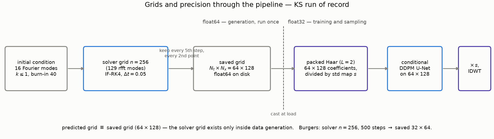

<small>Three grids, one identity to keep straight. The _solver_ grid
($n$ collocation points\; $n/2 + 1$ stored rfft modes, of which the 2/3 rule
retains $n/3$) exists only inside data generation. The _saved_ grid
($N_t \times N_x$) is the subsampled trajectory written to disk — for KS,
every 5th solver step and every 2nd point. The model's _predicted_ grid is
identical to the saved grid: the U-Net generates coefficient images of
exactly that shape and the inverse transform returns trajectories on it.
The precision boundary sits at dataset load.</small>

**The transform.** The 1D Haar DWT is the simplest orthonormal wavelet
transform: it replaces each adjacent pair of samples by its normalized average
and difference,

$$
a_i = \frac{u_{2i} + u_{2i+1}}{\sqrt{2}},
\qquad
d_i = \frac{u_{2i} - u_{2i+1}}{\sqrt{2}},
$$

halving the resolution while retaining exact invertibility: $(a, d)$ carries the
same information as $u$, reorganized into a coarse approximation plus the detail
needed to reconstruct it. The 2D transform is separable — apply the 1D transform
along $t$, then along $x$ — so one level yields four subbands (approximation,
detail in $t$, detail in $x$, diagonal), and recursing on the approximation for
$L$ levels gives part 3's multiresolution pyramid in two dimensions. Two design
choices deserve justification:

- _Why transform $(t, x)$ jointly?_ The structures that make PDE trajectories
  hard — a shock line moving through the plane — are localized in space **and**
  time together\; 2D wavelet atoms are localized in both coordinates at every
  scale, so the shock line touches only a few coefficients per level.
- _Why Haar?_ With periodic wrapping, Haar halves each axis exactly (no boundary
  padding), so a level-2 decomposition of a $32 \times 64$ trajectory packs into
  the classic nested layout of exactly $32 \times 64$ — the denoiser can be an
  ordinary image U-Net over the coefficient plane. (The paper uses smoother
  biorthogonal bases, `bior2.4`/`bior1.3` —
  [Hu et al., 2024](https://arxiv.org/html/2412.04833v3), Secs. 4.1 and 4.4\;
  Haar trades some coefficient sparsity for trivial shape bookkeeping.)

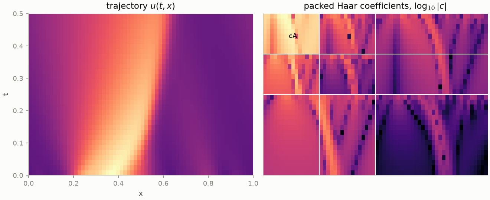

**Training and sampling.** In pseudocode, the whole of `train.py`:

```text
# preparation
W    <- dwt2_packed(trajectories)                  # (M, 32, 64) coefficient images
C    <- dwt2_packed(u0 tiled across the Nt frames) # conditioning images
s    <- std(W, axis=0), clipped away from 0        # per-coefficient scale map
W, C <- W / s,  C / s

# training loop
repeat:
    x0, c <- random minibatch from (W, C)
    k     ~  Uniform{0, ..., 299}                  # noise level
    eps   ~  N(0, I)
    xk    <- sqrt(abar_k) * x0 + sqrt(1 - abar_k) * eps
    loss  <- || UNet(xk, c, k) - eps ||^2          # predict the injected noise
    adam update on UNet parameters

# sampling (simulation)
x ~ N(0, I)
for k = 299 down to 0:
    x <- ancestral DDPM step using UNet(x, c, k)
return idwt2_packed(x * s)
```

The one non-obvious line is the scale map `s`. An orthonormal wavelet transform
preserves total energy but concentrates it: averaging gains $\sqrt{2}$ per level
per axis on the smooth content of the signal, while each detail coefficient
measures a local difference and sits near zero wherever the field is smooth. In
this dataset the level-2 approximation block has standard deviation
$\approx 1.7$ against $\approx 0.03$ for the finest detail subbands — a
$60\times$ disparity. The DDPM forward process, however, corrupts every
coordinate with noise of a single global scale, so a coefficient's
signal-to-noise ratio at any diffusion step is proportional to its own standard
deviation: with a $60\times$ spread there is no noise level at which both blocks
are usefully corrupted, and the detail subbands — which carry the front's
position — spend most of the schedule indistinguishable from pure noise, giving
the model no training signal for them. Dividing each coefficient by its standard
deviation over the training set gives every coordinate the same effective
schedule\; `s` is multiplied back before the inverse transform. Note the
contrast with part 3's compression argument, which exploits the same
concentration: compression may _discard_ the small coefficients, but a
generative model must reproduce their distribution — and can only learn to if it
can see them.

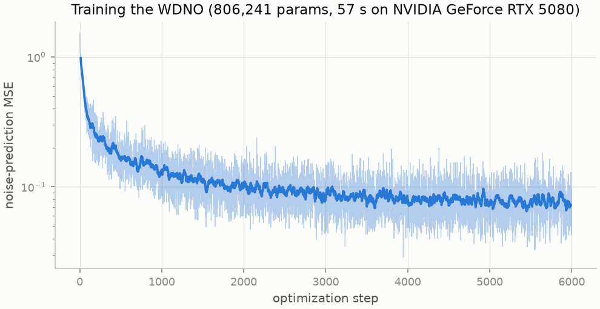

**Metrics.** Every accuracy number in the rest of this post is one of five
quantities — items 1, 2, 4, 5, 6 below — interpreted through the one
identity of item 3. Notation first: a saved trajectory is a matrix
$v \in \mathbb{R}^{N_t \times N_x}$, and everything is built from the
Frobenius norm and its inner product,

$$
\lVert v \rVert_F = \Bigl(\\, \sum_{k=0}^{N_t - 1} \sum_{m=0}^{N_x - 1} v_{km}^2 \Bigr)^{\\!1/2},
\qquad
\langle v, w \rangle = \sum_{k, m} v_{km}\\, w_{km},
\qquad
\lVert v \rVert_F^2 = \langle v, v \rangle .
$$

**1 — Trajectory rel-L2.** For held-out case $i$ with solver truth
$u^{(i)}$ and one conditional sample $\hat{u}^{(i)}$,

$$
\varepsilon_i = \frac{\lVert \hat{u}^{(i)} - u^{(i)} \rVert_F}{\lVert u^{(i)} \rVert_F},
\qquad
\varepsilon = \frac{1}{16} \sum_{i=1}^{16} \varepsilon_i .
$$

Every "rel-L2" in this post's tables and figure titles denotes this
$\varepsilon$: the mean of per-case ratios, not the ratio of pooled norms.
The uniform quadrature weight $\Delta t\\, \Delta x$ cancels in the ratio,
so $\varepsilon_i$ is the rectangle rule applied to the relative
$L^2([0,T] \times D)$ error norm. One DDPM sample per case: these are
single-sample errors — a draw from the learned conditional distribution, not
a posterior mean\; averaging several samples per input lowers them.

**2 — Per-frame error.** The same ratio on one time slice, then the case
mean:

$$
\varepsilon_i(t_k) = \frac{\lVert \hat{u}^{(i)}(t_k, \cdot) - u^{(i)}(t_k, \cdot) \rVert_2}{\lVert u^{(i)}(t_k, \cdot) \rVert_2},
\qquad
\varepsilon(t_k) = \frac{1}{16} \sum_{i=1}^{16} \varepsilon_i(t_k),
$$

with $\lVert \cdot \rVert_2$ the Euclidean norm on $\mathbb{R}^{N_x}$. Its
value at $t = 0$ isolates the conditioning-reconstruction error: frame 0 is
the state the sample is conditioned on.

**3 — The saturation limit.** Drop indices and let $\hat{u}, u$ be frame
vectors in $\mathbb{R}^{N_x}$ (the identity holds verbatim for whole
trajectories under $\lVert \cdot \rVert_F$). Expand the squared error and
divide by $\lVert u \rVert^2$:

$$
\lVert \hat{u} - u \rVert^2
= \langle \hat{u} - u,\\, \hat{u} - u \rangle
= \lVert \hat{u} \rVert^2 \\;-\\; 2\\,\langle \hat{u}, u \rangle \\;+\\; \lVert u \rVert^2 ,
$$

$$
\varepsilon^2
= \frac{\lVert \hat{u} \rVert^2 - 2\\,\langle \hat{u}, u \rangle + \lVert u \rVert^2}{\lVert u \rVert^2}
= r^2 \\;-\\; 2\\,r\cos\theta \\;+\\; 1,
\qquad
r = \frac{\lVert \hat{u} \rVert}{\lVert u \rVert},
\quad
\cos\theta = \frac{\langle \hat{u}, u \rangle}{\lVert \hat{u} \rVert\\, \lVert u \rVert} .
$$

This is the law of cosines: $\theta$ is the angle between the two frame
vectors in $\mathbb{R}^{N_x}$, and $\cos\theta$ their normalized correlation
(for mean-zero fields, exactly the Pearson correlation). "Decorrelation"
everywhere below means $\langle \hat{u}, u \rangle \to 0$: the sample
remains a legitimate attractor state, but its pointwise similarity to the
reference decays until the two vectors are **orthogonal** — a right angle,
$\theta = \pi/2$, in $\mathbb{R}^{N_x}$. Setting $\cos\theta = 0$,

$$
\varepsilon \\;\longrightarrow\\; \sqrt{1 + r^2\\,},
$$

and the classical $\sqrt{2}$ decorrelation limit is the equal-amplitude
case $r = 1$.

**4 — Standard-deviation ratio.** A pooled statistic: one standard
deviation over all (case, frame, grid-point) values in the stated frame
window, sample over truth. The KS attractor is near mean-zero, so the
pooled standard deviation is the pooled RMS amplitude — the $r$ of item 3 —
which is what lets the measured plateau be checked against the measured
amplitude deficit.

**5 — Band-spectrum ratios.** With $\hat{U}^{(i)}(t_k, j)$ the length-$N_x$
DFT (part 2's convention) of frame $t_k$ along $x$,

$$
P(j) = \operatorname{mean}\_{i,\\; t_k \ge 8}\\, \bigl| \hat{U}^{(i)}(t_k, j) \bigr|^2 ,
\qquad
R_{[a,b]} = \frac{\sum_{j=a}^{b} P_{\text{sample}}(j)}{\sum_{j=a}^{b} P_{\text{truth}}(j)}
$$

— the DFT normalization cancels in $R$. The domain length is fixed at
$L = 32\pi$, so integer mode $j$ corresponds to wavenumber
$2\pi j / L = j/16$ in the units of the symbol section.

**6 — Subband error fractions.** Periodic Haar is orthonormal, so Parseval
turns the packed transform $\mathcal{W}$ into an exact decomposition of the
squared error over subbands $b$,

$$
\lVert \hat{u} - u \rVert_F^2
= \sum_b \bigl\lVert [\mathcal{W}(\hat{u} - u)]\_b \bigr\rVert_F^2 ,
$$

and each quoted fraction is one block's share of the right-hand side. The
identity is asserted numerically in every run.

Sixteen held-out initial conditions, one DDPM sample each (300 denoising steps, ~2 s
total for all sixteen):

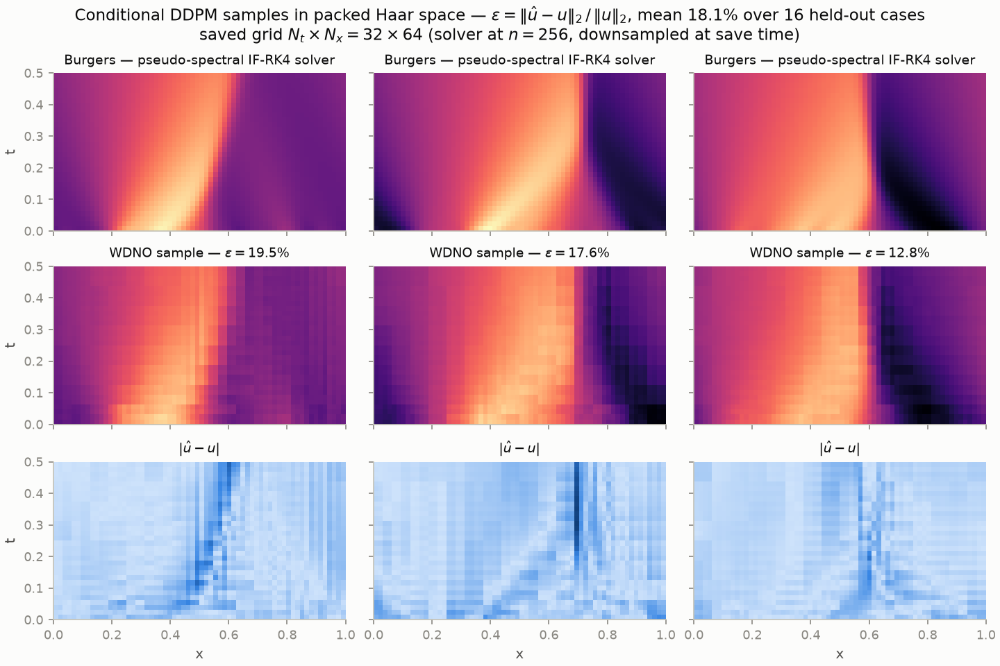

<small>Every panel is rendered on the saved trajectory grid
$N_t \times N_x = 32 \times 64$ — the resolution the model is trained on and
generates at. The solver itself runs at $n = 256$ in float64 and is
downsampled at save time, so the blockiness is the data's discretization,
not the solver's.</small>

Mean whole-trajectory rel-L2 ≈ **18%**, with the error visibly concentrated along
the moving shock — the sample nails the global transport and diffuses about the
exact front position, which is the honest failure mode for a generative model this
size. This number answers a different question than
[the WNO of part 3](@/posts/post-3-wavelets-wno/index.md), which was scored on a
single endpoint field — whole-trajectory and endpoint rel-L2 are not comparable
quantities, so no side-by-side is offered. A further caveat: one diffusion sample
is a draw from a distribution, not a posterior mean — averaging several samples
per input lowers the number.

## Benchmarks

Both operators were benchmarked on the 1D viscous Burgers system above, on one
machine (Ryzen 9800X3D CPU\; RTX 5080 GPU\; JAX on WSL2), via
`pixi run [-e cuda] wno-bench` and `wdno-bench`. All throughputs are measured
after JIT compilation, with results fetched from the device only at the end of
the timed region — they reflect computation, not host–device transfer. One
_training step_ is a full Adam update (forward, backward, parameter update) on
one minibatch\; one _operator evaluation_ is a single forward pass mapping an
initial condition to an endpoint\; one _sampled trajectory_ is 300 sequential
denoiser evaluations.

| quantity                                                          | unit           | CPU   | RTX 5080 | GPU/CPU |
| ----------------------------------------------------------------- | -------------- | ----- | -------- | ------- |
| WNO training (batch 32, $n = 256$)                                | steps/s        | 35.8  | 199.2    | 5.6×    |
| WNO inference (batch 128)                                         | evaluations/s  | 2,954 | 116,735  | 40×     |
| WDNO U-Net training (batch 16, $32 \times 64$ coefficient images) | steps/s        | 9.5   | 183.9    | 19×     |
| WDNO sampling (batch 16, 300 denoiser calls each)                 | trajectories/s | 2.0   | 3.8      | 1.9×    |

End-to-end wall time deviates from these rates in one systematic way. The
training script logs the loss every step, which transfers a scalar to host and
stalls the GPU pipeline: the WNO's 12,000 steps take 104 s on the GPU (about 60 s
of computation at the benchmarked rate plus about 44 s of synchronization
stalls) versus 339 s on the CPU, which is compute-bound and unaffected by the
transfers. This is also why every published run records
`jax.default_backend()` in `metrics.json`: device attribution belongs in the
artifact, not in a figure caption.

The spread of speedups — 1.9× to 40× on the same hardware — is explained by
arithmetic intensity and kernel count rather than model size. A WNO layer
executes dozens of small kernels per step (sequential DWT filter convolutions,
per-subband einsums), each doing little arithmetic per launch, so training is
launch-latency-bound — a regime WSL2's added launch overhead
([NVIDIA developer blog](https://developer.nvidia.com/blog/leveling-up-cuda-performance-on-wsl2-with-new-enhancements/))
makes worse\;
batched inference amortizes those launches over 128 inputs at once and reaches
40×. The WDNO's U-Net spends its time in wide convolutions with substantial
arithmetic per kernel, hence 19× in training\; its sampling gains only 1.9×
because 300 denoiser calls are inherently sequential and a batch of 16 small
images does not saturate the device — larger sampling batches should recover
most of the difference (unmeasured).

These numbers are specific to a small 1D system. Two-dimensional fields (the
paper's smoke-control setting) increase the work per kernel and widen every GPU
margin\; deeper wavelet decompositions or longer filters do the opposite,
adding small sequential kernels. Dataset generation with the spectral solver is
sequential across time steps in the same way sampling is, and parallelizes on
the GPU only across initial conditions (`vmap`). Where each equation in the
roadmap below lands on this spectrum is measured as it is added, alongside
accuracy.

## Fidelity of the domain: accuracy vs $N_x$

A natural question the setup above can answer directly: how does sample
accuracy change as the saved resolution of the domain increases? The sweep
holds the _physics_ fixed — the same solver at $n = 256$, the same initial
conditions, the same $2{,}064$ trajectories — and varies only how finely each
trajectory is saved: $N_x \in \\{32, 64, 128, 256\\}$ at $N_t = 32$. Everything
else is pinned: level-2 Haar packing, the same U-Net (fully convolutional, so a
wider coefficient image drops in unchanged), the same 6,000-step budget, the
same 16 held-out initial conditions. Since rel-L2 at each resolution
approximates the same continuum quantity, the numbers are directly comparable\;
what changes with $N_x$ is only how much of the field the model must
synthesize.

| $N_x$ | Haar level | steps  | trajectory rel-L2 | train (s) |
| ----- | ---------- | ------ | ----------------- | --------- |
| 32    | 2          | 6,000  | 19.5%             | 56        |
| 64    | 2          | 6,000  | 18.1%             | 55        |
| 128   | 2          | 6,000  | 20.0%             | 67        |
| 256   | 2          | 6,000  | **33.7%**         | 104       |
| 256   | 3          | 6,000  | 35.2%             | 82        |
| 256   | 2          | 12,000 | **20.6%**         | 184       |

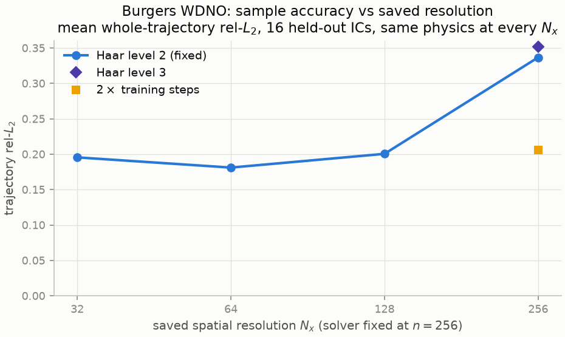

At a fixed budget the error is flat within noise from $N_x = 32$ to $128$, then
jumps at $256$. Two controls say the jump is not "resolution" in any intrinsic
sense. Deepening the pyramid to level 3 — so the coarse block keeps its
relative size — makes things slightly _worse_ (35.2%), ruling out the fixed
packing depth. Doubling the training steps at $N_x = 256$ recovers 20.6%, right
back at the level of the coarser grids: the jump is a training-budget effect,
not a capability ceiling.

The subband decomposition of the error refutes the tempting explanation
outright. One might expect a finer grid to hurt because the new fine detail
bands are hard to generate — but viscous Burgers at $\nu = 0.01$ is smooth, the
finest rings hold under 0.1% of the truth's energy at $N_x = 256$, and the
squared error is dominated by the _coarse_ approximation block at every
resolution (47% of it at $N_x = 32$, 97% at $256$). What a finer domain
actually costs is budget per coefficient: the packed image grows from
$32 \times 64 = 2{,}048$ coefficients at the baseline to $8{,}192$ at
$N_x = 256$, so the same 6,000 steps must synthesize the same coarse structure
with a quarter of the optimization effort per coefficient. The honest
headline is "at fixed budget, cost per unit accuracy grows with $N_x$," not
"WDNO degrades with resolution" — with one confound left standing: the U-Net's
receptive field is fixed, so it shrinks relative to the domain as $N_x$ grows,
and this sweep does not separate that from the budget effect. The experiment
is one script (`scripts/sweep_burgers_nx.py`, run here on the float64-regenerated
datasets via `scripts/retrain_f64.py`) and about ten minutes of GPU time.

There is a second, distinct notion of domain fidelity: the _solver's_ grid —
refining not how finely the truth is saved but how finely it is computed. That
sweep ($n = 256 \to 512 \to 1024$, same continuum initial conditions via exact
spectral upsampling, saved target fixed at $32 \times 64$) is a deliberate null
result. In the float32 production pipeline the saved trajectories move by
rel-L2 $\approx 4 \times 10^{-6}$ — the accumulation floor, and notably _not
shrinking_ from 512 to 1024, the signature of arithmetic noise rather than
truncation error\; the double-precision convergence study above pins the true
truncation distance of the $n = 256$ grid at $7 \times 10^{-13}$. The trained
WDNO's test error is identical to four decimals across all three solver
grids. The physical reason is measurable: with initial conditions
band-limited to $k \le 16$ and $\nu = 0.01$, the solution energy beyond the
$n = 256$ solver's dealiased band is $\sim 10^{-14}$ of the total — the
viscous cutoff sits far below the grid's Nyquist, so a finer solver has
nothing to add. The two sweeps therefore separate cleanly: the truth's error
floor — truncation at $10^{-13}$ in double precision, arithmetic at
$10^{-6}$ as saved in float32 — is negligible against the model's $0.18$,
and the entire resolution story above lives on the
representation-and-training side. (Reproduce:
`scripts/sweep_burgers_solver_n.py`\; solver fidelity would start to bite only
at much smaller $\nu$ or with broader-band initial conditions.)

## A second equation: Kuramoto–Sivashinsky

The equation-agnostic solver makes a second experiment inexpensive, so here is the
template — scenario, model, analysis, computation, results — run once more, on a
system chosen to stress the opposite regime from Burgers: not a single front
sharpening under dissipation, but sustained spatiotemporal chaos.

**Scenario and model.** The
[Kuramoto–Sivashinsky equation](https://en.wikipedia.org/wiki/Kuramoto%E2%80%93Sivashinsky_equation)
arises as the normal form of several instability-driven systems — flame-front
wrinkling, thin liquid films, drift waves in plasmas:

$$
\frac{\partial u}{\partial t}
\\;+\\; u\\,\frac{\partial u}{\partial x}
\\;+\\; \frac{\partial^2 u}{\partial x^2}
\\;+\\; \frac{\partial^4 u}{\partial x^4}
= 0 .
$$

**Analysis.** Splitting as before, the nonlinearity is the same Burgers term
$\mathcal{N}(u) = -\tfrac{1}{2}\partial_x(u^2)$, and the linear operator
$\mathcal{L} = -\partial_x^2 - \partial_x^4$ has symbol

$$
\ell(k) = -(ik)^2 - (ik)^4 = k^2 - k^4 .
$$

The sign structure is the whole story of this equation. For $0 < k < 1$ the symbol
is _positive_: long modes grow — the $-\partial_x^2$ term is an _anti_-diffusion,
injecting energy (the instability). For $k > 1$ the $k^4$ hyperdiffusion dominates
and short modes are damped hard. Neither behavior alone is interesting\; the
nonlinearity couples them, transferring energy from the unstable band into the
damped band, and the balance is deterministic chaos. On a domain of length $L$ the
unstable modes are $k_j = 2\pi j / L < 1$, so $L = 32\pi$ admits roughly sixteen of
them — comfortably chaotic. The $k^4$ stiffness is also the reason the integrating
factor earns its keep here: an explicit stepper would need $\Delta t \sim \Delta
x^4$.

**Computation.** `pixi run -e cuda wdno-data-ks wdno-train-ks`. Random smooth
initial conditions are integrated for a burn-in of 40 time units first, so every
recorded trajectory starts on the chaotic attractor rather than in the smooth
transient\; the dataset is then $2{,}064$ trajectories of 64 frames over $t \in
[0, 16]$ at 128 saved grid points ($\Delta t = 0.05$, solver at $n = 256$) —
four times the coefficient count of the Burgers baseline, chosen so the saved
grid actually resolves the attractor's cells on screen. The model, packing, and
normalization are identical to the Burgers case — the U-Net is fully
convolutional, so the wider coefficient image drops in unchanged — and the
training budget is scaled with the coefficient count exactly as the resolution
sweep above prescribes: $4\times$ the coefficients, $4\times$ the steps
(24,000), 320 s on the RTX 5080. (Reproduce: `scripts/regen_f64_datasets.py`
then `scripts/retrain_f64.py`\; a first pass at the Burgers-sized
$32 \times 64$ save and 6,000 steps is kept as the comparison point below.)

**Results.** The conditional samples reproduce the attractor's texture — cellular
structures of the correct width, merging and splitting — but they do not track the
reference trajectory:

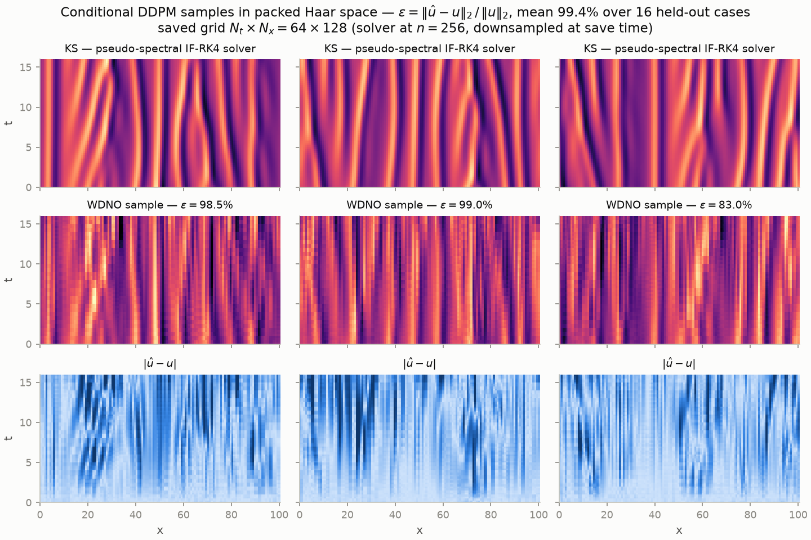

<small>Rendered on the saved trajectory grid $N_t \times N_x = 64 \times 128$
over $t \in [0, 16]$, $x \in [0, 32\pi]$ (solver at $n = 256$ in float64,
downsampled at save time) — the resolution the model is trained on and
generates at.</small>

The per-frame error curve $\varepsilon(t)$ is the informative object here — the
whole-trajectory mean (99%) is dominated by post-decorrelation frames and is an
expectedly saturated quantity, not an error in the naive sense:

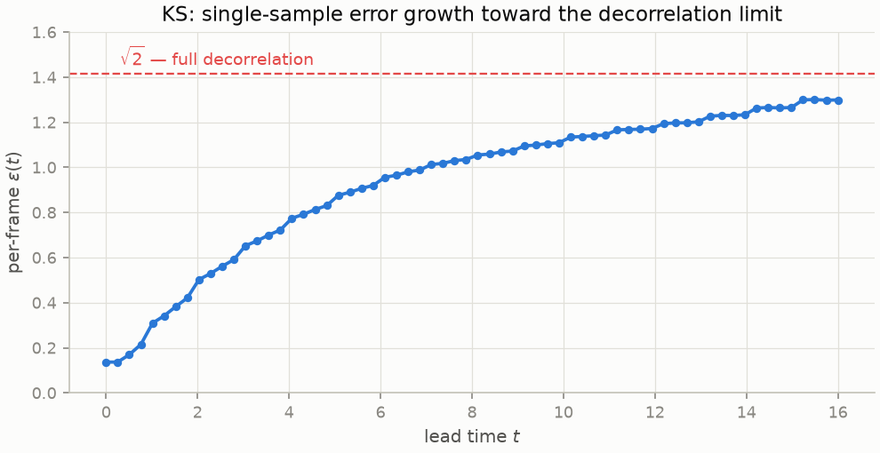

For two fields with equal energy and no correlation,

$$
\varepsilon = \frac{\lVert \hat{u} - u \rVert_2}{\lVert u \rVert_2}
\\;\longrightarrow\\; \sqrt{2},
$$

and the samples approach that limit by late trajectory. Chaos guarantees some
version of this curve for _every_ method: a positive Lyapunov exponent
amplifies any initial discrepancy exponentially, and the sample starts with a
14% reconstruction error at frame 0 (the conditioning is imperfect), so
pointwise agreement is lost within a few time units — $\varepsilon$ crosses
100% around $t \approx 7$. (At the coarser $32 \times 64$ save and 6,000
steps, the frame-0 error was 34% and the crossing came at $t \approx 4$: the
extra fidelity and budget more than double the window in which the sample
actually tracks the reference.)

This is the regime where the generative framing stops being a luxury: past the
predictability horizon, only distributional questions are meaningful. On that
score the model is partially successful. The sampled fields carry
$\approx$ 84% of the true standard deviation (pooled ratio as defined in the
metrics block: 0.85 over all frames, 0.83 over the late window $t \ge 8$),
and the amplitude deficit is exactly what caps the error curve: with the
correlation term gone, $r \approx 0.83$ predicts a plateau at
$\sqrt{1 + r^2} = 1.30$ — precisely where the measured curve flattens, just
under $\sqrt{2}$. The late-time spatial spectrum is distorted as well: the
energetic bands run uniformly low (modes 4–7, physical wavenumbers
$k \in [0.25, 0.44]$, at $0.72\times$ the true band energy — a
seed-sensitive number, 0.72–0.84 across three training seeds\; modes 8–13,
$k \in [0.50, 0.81]$, at $0.47\times$, seed spread 0.47–0.52).
Interestingly, the distortion is a training artifact rather than anything
structural — the coarse baseline run distorted in the _opposite_ direction,
over-weighting modes 4–7 at $2\times$.

A single-variable lever study locates the deficits
(`scripts/exp_ks_levers.py`\; three baseline seeds define the significance
band behind every claim here). Training budget helps but asymptotes: across
$24\text{k} \to 48\text{k} \to 96\text{k}$ steps, modes 8–13 go
$0.47 \to 0.62 \to 0.67$ (+0.15, then +0.04 per doubling), the pooled late
std $0.83 \to 0.87 \to 0.89$, the crossing
$t \approx 7 \to 8.5 \to 9.5$ — decelerating on every distributional
metric, well short of 1. (Modes 4–7 are non-monotone in budget, and only
the 96k point, 0.91, clears the seed band\; that band's 0.12 seed spread
absorbs the intermediate wiggles.) An exponential moving average of the
weights changes nothing — it agrees with the raw weights to $10^{-3}$,
because under the decayed late-phase learning rate the EMA reduces to the
identity. A third U-Net downsampling (1.75M parameters) lengthens tracking
while pushing the late std _below_ the seed band — receptive field is not
the bottleneck.

The deficit's actual owner is the diffusion parameterization. A cosine
$\beta$ schedule under the baseline's $\epsilon$-prediction trains to the
same loss as linear but _diverges at sampling_, block-structured on the
coarse Haar subbands. The mechanism is the $\epsilon \to x_0$ map:
recovering the clean estimate divides by $\sqrt{\bar{\alpha}}$, which
amplifies prediction error without bound as the cosine schedule's terminal
$\bar{\alpha} \to 0$\; pixel-space DDPMs survive this by clipping $x_0$ to
$[-1, 1]$, a rescue with no analogue for unbounded wavelet coefficients.
Switching to $v$-prediction
([Salimans & Ho, 2022](https://arxiv.org/abs/2202.00512)) removes the
amplification at its source, and the identical cosine schedule then samples
cleanly with no clipping of any kind. It is not merely a stability fix. At
the unchanged 24,000-step budget, $v$-prediction moves every distributional
metric outside the seed band toward 1 (two seeds: modes 4–7 at 0.90/0.96,
modes 8–13 at 0.59/0.66, late std 0.86/0.89, crossing at
$t \approx 10.3$–$10.5$)\; on the cosine schedule it reaches the best
amplitude of any configuration — pooled std 0.94 over all frames, 0.92
late, modes 8–13 at 0.71, crossing $t \approx 12.3$. The final-frame
$\varepsilon$ fell to 1.19–1.23 even as $r$ rose, and by item 3 of the
metrics block that combination forces $\cos\theta > 0$ through the horizon:
genuinely longer correlation, not lost energy. Dynamic thresholding on
normalized coefficients, added as a guard, is a measured no-op (every
metric delta $< 0.007$ against a same-sampling-key control). Two honest
residuals: frame-0 conditioning-reconstruction error rises from 0.13 to
0.17 under $v$-prediction on either schedule — an SNR-weighting trade
between the near-clean and near-noise ends of the diffusion, which makes
the loss weighting the natural next single variable — and modes 4–7 under
$v$+cosine fell back to 0.74 on the single seed run so far, a number that
stays unclaimed until a replicate.

One control before pointing the finger at the model: was the data-generation
grid itself adequate for a chaotic system? In double precision the answer is
sharp. Solving the same on-attractor initial states on grids from $n = 48$ to
$512$ against a float64 $n = 1024$ reference — at the dataset's own
$\Delta t = 0.05$ over the dataset's own horizon — the $n = 256$ data grid
sits at a per-frame $\varepsilon \approx 9 \times 10^{-7}$ that is _flat
across the entire trajectory_: a quasi-steady truncation bias, with no
visible chaotic amplification within $t \le 16$. The float32 solver run from
the identical initial state tells the complementary story: it starts at the
same $10^{-6}$ but grows to $3.5 \times 10^{-5}$ by the end of the horizon —
what chaos amplifies is the round-off noise injected fresh at every step, not
the systematic truncation error, and an earlier float32-only version of this
control was measuring exactly that amplified noise. Neither curve threatens
the data: even the growing one would need on the order of a hundred time
units at its measured rate to reach the $\sqrt{2}$ decorrelation limit, and
the horizon is 16. A deliberately coarse $n = 128$ grid, pointwise wrong at
the flat 0.5–0.9% level, still matches the late-time band spectra to 0.5% and
trains an indistinguishable model. Every model pathology above — the frame-0
conditioning error at 14%, the standard-deviation deficit, the band-spectrum
distortion — sits four or more orders of magnitude above the data's
truncation level: the error budget belongs entirely to the model. The
dataset regeneration makes the same point from the other side: rebuilding
the KS training set with float64 generation moves the saved trajectories by
rel-L2 $\sim 10^{-3}$ — the original float32 round-off amplified through the
40-unit burn-in at the measured rate ($\approx 0.11$ per time unit), far
above the truncation bias — and every metric of the model retrained on it is
unchanged to the third decimal. (Reproduce:
`scripts/sweep_ks_x64_refinement.py` and `scripts/regen_f64_datasets.py`\;
the float32-era control, `scripts/sweep_ks_solver_n.py`, additionally
trained a WDNO per solver grid and found them indistinguishable.)

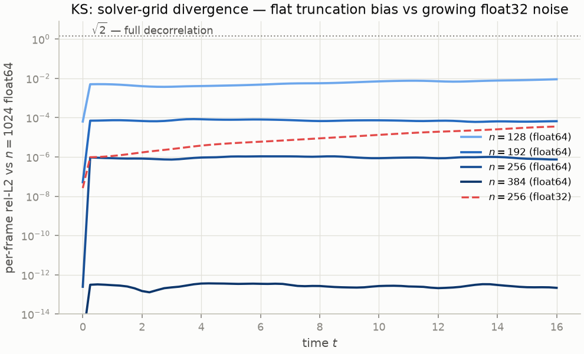

<small>Per-frame rel-L2 against the float64 $n = 1024$ reference, mean over
eight on-attractor initial conditions, $\Delta t = 0.05$. Solid: float64 —
truncation bias, flat in time. Dashed: the same $n = 256$ solve in float32 —
round-off noise, amplified by the flow.</small>

## Where to take it

The point of making the solver equation-agnostic is that every next experiment is
now a few lines: pass different symbol and nonlinearity terms, regenerate trajectories,
retrain. A roadmap in rough order of what each problem :

- **[KdV](https://websites.umich.edu/~millerpd//docs/651_Winter18/Topic02-651-W18.pdf)** — solitons and dispersive shocks\; sharp coherent structures that travel
  and interact, ideal for validating super-resolution on localized features.
- **Kuramoto–Sivashinsky** — the first pass above leaves a concrete
  target: match the attractor's late-time spectrum, and evaluate distributionally
  (spectra, structure functions) rather than by trajectory error.
- **Compressible Euler (Sod tube)** — genuine discontinuities: contacts,
  rarefactions, shocks\; the regime where the paper's 25× lives.
- **[FitzHugh–Nagumo](https://arxiv.org/html/2404.11403v2)** — traveling excitation waves with steep fronts\; the guided control story maps naturally onto spiral-wave suppression (defibrillation, neuronal models, data-driven modeling).
- **Nonlinear Schrödinger** — optical solitons and rogue-wave statistics\; where
  the series' signal-processing and PDE threads meet.

All the listed 1D equations drop into `ftx.spectral` as a symbol plus a
nonlinearity, and each addition follows the template this post ran twice —
physical scenario → PDE → symbol and nonlinearity → discretization → trained
operator → results. What's missing versus the paper — and the natural next build
— is **control**: add a forcing channel to the dataset and the guided update
above\; 1D Burgers control is exactly the paper's first benchmark.

The through-line of the series, one last time: _find the basis that makes
your operator simple, act there, come back._ Euler's formula supplies the basis\;
the FFT makes the round trip cheap\; wavelets rebuilds the basis for a world with
edges\; neural operators learn the middle from data\; and the WDNO makes the
middle a distribution you can sample and steer.

### Further reading

- Hu et al., ["Wavelet Diffusion Neural Operator"](https://arxiv.org/abs/2412.04833)
  (2024) — the paper this post follows\; [code](https://github.com/AI4Science-WestlakeU/wdno).
- Ho, Jain & Abbeel, ["Denoising Diffusion Probabilistic Models"](https://arxiv.org/abs/2006.11239)
  (2020) — the DDPM machinery used verbatim here.
- Kovachki et al., ["Neural Operator: Learning Maps Between Function Spaces"](https://arxiv.org/abs/2108.08481)
  (2021) — the general theory behind parts 3 and 4.
- Kassam & Trefethen, ["Fourth-order time-stepping for stiff PDEs"](https://doi.org/10.1137/S1064827502410633)
  (2005) — the classic on exponential integrators for exactly the KdV/KS setups above.
- Mallat, _A Wavelet Tour of Signal Processing_ — still the reference for everything
  the DWT does here.

## Sources

Grouped by the claim they support.

- **Kuramoto-Shivinsky Equation**:
  [Kuramoto-Shivinsky Equation]()
  [Evolving Planar Flame Front]()
  [PDEs with nonlinear/chaotic behavior]()
  [Stability of pole solutions for planar propagating flames](https://epubs.siam.org/doi/10.1137/S0036139998346439)
- **Diffusion models smear abrupt changes and struggle with resolution transfer**
  (the paper's own motivating premise, stated in its abstract):
  [Hu et al., 2024, arXiv:2412.04833](https://arxiv.org/abs/2412.04833)\;
  [OpenReview (ICLR 2025)](https://openreview.net/forum?id=FQhDIGuaJ4).
- **Benchmark numbers in "What the paper reports"** — all six figures verified
  against Table 1 (simulation MSE) and Table 2b (2D smoke control objective) of
  [arXiv:2412.04833v3](https://arxiv.org/html/2412.04833v3) (revised 2025-06-26)\;
  the "78% less leakage" figure appears verbatim in the abstract of
  [arXiv:2412.04833](https://arxiv.org/abs/2412.04833).
- **"Significantly inferior" FFT-vs-DWT ablation quote**:
  [Hu et al., 2024](https://arxiv.org/abs/2412.04833), Sec. 4.7 (Ablation Study),
  Fig. 5(c) — the ablation runs on the 1D compressible Navier–Stokes system.
- **Raw-space multi-resolution scheme degrades as super-resolution steps stack**:
  [Hu et al., 2024, Sec. 4.7, Fig. 4(c)](https://arxiv.org/html/2412.04833v3#S4.SS7).
- **ERA5 dataset specifics** (hourly estimates, regular 0.25° lat–lon grid):
  [Copernicus CDS, ERA5 single levels overview](https://cds.climate.copernicus.eu/datasets/reanalysis-era5-single-levels?tab=overview)
  — note CDS states coverage from **1940 onwards**\;
  the 12-hour-history → 20-hour-forecast temperature task:
  [Hu et al., 2024](https://arxiv.org/abs/2412.04833).
- **Guided-sampling update equation**: Eq. 4 of
  [Hu et al., 2024](https://arxiv.org/html/2412.04833v3), Sec. 3.1 (including
  evaluating $J$ at the DDPM clean-sample estimate)\; general gradient-guidance
  lineage: [Dhariwal & Nichol, 2021, arXiv:2105.05233](https://arxiv.org/abs/2105.05233).
- **The 2/3 dealiasing rule is exact for quadratic nonlinearities**:
  [Orszag, 1971, J. Atmos. Sci. 28:1074](https://doi.org/10.1175/1520-0469%281971%29028%3C1074:OTEOAI%3E2.0.CO;2)\;
  corroborated by
  [Giacomini & Giometto, GMD 2017 preprint](https://gmd.copernicus.org/preprints/gmd-2017-272/gmd-2017-272.pdf),
  [Bowman, "Origin of the 2/3 Rule" (IPAM slides)](http://helper.ipam.ucla.edu/publications/mtws1/mtws1_12187.pdf),
  and the [FourierFlows.jl aliasing docs](https://fourierflows.github.io/FourierFlowsDocumentation/stable/aliasing/).
  "Exact" means the retained two-thirds of modes are alias-free (equivalently the
  padded 3/2 rule), not that the product's full spectrum is resolved.
- **Spectral accuracy of Fourier collocation** (error decays faster than any
  power of $1/n$ for smooth periodic solutions):
  [Trefethen, _Spectral Methods in MATLAB_, SIAM 2000](https://epubs.siam.org/doi/book/10.1137/1.9780898719598),
  ch. 4\; the exponential-integrator time-stepping and its fourth-order accuracy
  for stiff PDEs: [Kassam & Trefethen, 2005](https://doi.org/10.1137/S1064827502410633).
- **Von Neumann analysis, the amplification factor, the $1 + C\\,\Delta t$
  condition, the unstable centered-Euler advection scheme, and the
  Lax–Friedrichs CFL bound**:
  [D. Venturi, AM 213B lecture notes, ch. 10 (UCSC), archived PDF](https://web.archive.org/web/20250327044646/https://venturi.soe.ucsc.edu/sites/default/files/CHAPTER_10_Numerical_methods_for_the_advection_equation_0.pdf)
  — Eqs. 26–32 (mode ansatz, amplification factors, the practically-unstable
  centered scheme) and Eqs. 47–49 (Lax–Friedrichs, Courant number)
  [von Neumann stability analysis](https://en.wikipedia.org/wiki/Von_Neumann_stability_analysis)\;
  condition lineage,
  [Courant–Friedrichs–Lewy](https://en.wikipedia.org/wiki/Courant%E2%80%93Friedrichs%E2%80%93Lewy_condition).
  The RK4 imaginary-axis identity and its $2\sqrt{2}$ boundary are derived
  in-text by direct expansion of the stability polynomial and confirmed
  numerically to machine precision ($|R(i\theta)| = 1$ at
  $\theta = 2\sqrt{2} \approx 2.8284$, exceeding 1 beyond it).
- **Float32 production-pipeline refinement measurements** (Burgers saved-data
  rel-L2 floor $\sim 4 \times 10^{-6}$, not shrinking with $n$\; KS float32
  divergence growth with rate $\approx 0.1$–$0.2$/unit\; stability and
  boundedness at $n = 1024$ at the dataset time steps\; a WDNO trained per KS
  solver grid is indistinguishable): this repo,
  `scripts/sweep_burgers_solver_n.py` and `scripts/sweep_ks_solver_n.py`,
  sweep artifacts of 2026-07-25 (RTX 5080).
- **Double-precision solver-error studies** (the two-panel convergence figure
  and the KS divergence figure): this repo,
  `scripts/sweep_burgers_x64_refinement.py` (Burgers: geometric decay to the
  $4 \times 10^{-16}$ round-off floor at $n = 512$, $n = 256$ at
  $7 \times 10^{-13}$, float32 floor $2.4 \times 10^{-5}$ at 2,000 steps) and
  `scripts/sweep_ks_x64_refinement.py` (KS: $n = 256$ flat at
  $\approx 9 \times 10^{-7}$ over the full horizon, $n = 384$ at
  $2 \times 10^{-13}$, float32 floor $3.5 \times 10^{-5}$\; energy pile-up
  $15\times$ at $n = 48$), sweep artifacts of 2026-07-25/26 (CPU, JAX with
  `jax_enable_x64`). Identical continuum initial conditions across grids and
  precisions via exact spectral synthesis/truncation (KS states burned in 40
  units on the reference grid), errors measured after exact spectral
  upsampling to the reference grid, all norms in numpy float64.
- **KS run of record ($64 \times 128$ saved grid, 24,000 steps)** — mean
  $\varepsilon$ 99.4%, frame-0 error 13.7%, std ratios 0.85/0.83, band ratios
  0.72×/0.47×, and the $32 \times 64$/6,000-step comparison numbers (34%
  frame-0, $2\times$ modes 4–7): this repo, artifacts `wdno-ks-64x128-f64/`
  and `wdno-ks-f64/` of 2026-07-26 (RTX 5080, float64 data, float32
  training)\; the saved trajectories at the two resolutions are
  bitwise-nested (the finer save strided by 2 reproduces the coarser
  exactly), and the earlier float32-data runs (`wdno-ks-64x128/`, `wdno-ks/`,
  2026-07-25) agree on every quoted number.
- **KS lever study, rounds 1–2** (three-seed significance bands\; the
  24k/48k/96k budget trend, EMA null, third-downsampling result\; the
  cosine-under-$\epsilon$ sampling divergence at matched training loss and
  its $1/\sqrt{\bar{\alpha}}$ mechanism\; the $v$-prediction results on both
  schedules, two seeds on the linear-schedule run\; the dynamic-thresholding
  no-op control): this repo, `scripts/exp_ks_levers.py`, artifacts
  `exp-ks-levers/` of 2026-07-26 (RTX 5080). $v$-parameterization:
  [Salimans & Ho, "Progressive Distillation for Fast Sampling of Diffusion
  Models", 2022, arXiv:2202.00512](https://arxiv.org/abs/2202.00512).
- **Float64 dataset regeneration and its null result** — regenerated
  datasets move by rel-L2 $1.8 \times 10^{-6}$ (Burgers, arithmetic floor)
  and $\sim 10^{-3}$ (KS, round-off amplified through the burn-in at
  $\approx 0.11$/unit)\; every retrained metric unchanged beyond the fourth
  decimal\; a full-float64 _training_ control (5–12× step time on the RTX 5080) differs only at reseeding scale, x64 changing JAX's random streams:
  this repo, `scripts/regen_f64_datasets.py` and `scripts/retrain_f64.py`,
  `_f64` caches and `-f64`/`-tf64` artifacts of 2026-07-26.
- **Wavelet bases `bior2.4`/`bior1.3` in the paper**:
  [Hu et al., 2024](https://arxiv.org/html/2412.04833v3), Sec. 4.1 (`bior2.4`,
  1D Burgers) and Sec. 4.4 (`bior1.3`, 2D incompressible fluid).
- **WSL2 adds GPU kernel-launch overhead in launch-latency-bound regimes**:
  [NVIDIA, "Leveling up CUDA Performance on WSL2 with New Enhancements"](https://developer.nvidia.com/blog/leveling-up-cuda-performance-on-wsl2-with-new-enhancements/)
  (vendor engineering blog, the primary source for the WSL2 CUDA driver path).
- **The WNO's 9.7% endpoint rel-L2**:
  [part 3 of this series](@/posts/post-3-wavelets-wno/index.md), training-curve
  figure (test rel-L2 = 0.097).
