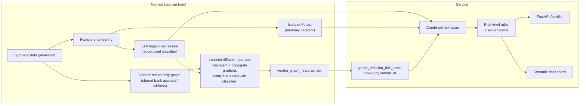

+++
title = "Graph Diffusion for Payment-Integrity Risk Scoring"
date = "2026-06-14"
weight = 1 

description = "Inside a synthetic-data prototype that scores public-finance payments for fraud risk: a JAX logistic regression classifier, an anomaly detector, and a graph-diffusion 'guilt by association' feature -- with the spectral math and the plots that come out of it."

[taxonomies]
tags = ["machine-learning", "jax", "graph-theory", "streamlit"]
+++

<!--
Zola page-bundle note: this file assumes it lives at
content/.../graph-diffusion-payment-integrity/index.md with the referenced
PNGs copied alongside it into an `images/` subdirectory (Zola serves
page-bundle assets relative to the page). The source PNGs are generated by
`pixi run evaluate`, `pixi run compare-models`, and
`pixi run analyze-graph-diffusion` into `reports/` in the project repo.
-->

## Why this exists

Improper payments and vendor fraud are persistent risks in public-finance
operations, and review capacity is always limited. This project is a
prototype **payment-integrity risk scoring system**: it takes a single
payment transaction, scores it for fraud/payment-integrity risk in `[0, 1]`,
assigns a `low` / `medium` / `high` risk level, and produces a short list of
human-readable reasons for that score. The model **recommends**; a human
**decides** -- nothing is automatically blocked, approved, or reported.

Everything in this article is computed on **synthetic data only**. No real
vendor, payment, or personal information is used anywhere. The point of the
prototype is to demonstrate a complete, auditable pipeline -- data generation,
feature engineering, training, evaluation, and serving -- with every modeling
choice documented and, where relevant, derived from first principles.

## Architecture at a glance



Two models feed a combined score:

- A **JAX logistic regression classifier**, trained on a class-weighted,
  L2-regularized binary cross-entropy loss:

  $$
  \mathcal{L}(w, b) = \frac{1}{n}\sum_{i=1}^n c_i\big[-y_i\log\hat p_i -
  (1-y_i)\log(1-\hat p_i)\big] + \lambda \lVert w \rVert_2^2, \qquad
  \hat p_i = \sigma(x_i^\top w + b)
  $$

  The per-example weight $c_i$ is $n/(2n_{\text{pos}})$ for fraud rows and
  $n/(2n_{\text{neg}})$ for non-fraud rows, so the ~5% fraud class
  contributes as much to the gradient as the ~95% non-fraud class --
  class-weighting instead of resampling. Trained with $\eta=0.05$,
  $\lambda=10^{-4}$, 500 full-batch gradient-descent epochs.

- A scikit-learn **IsolationForest anomaly detector** on the same scaled
  feature matrix, catching transactions that look statistically unusual even
  if the classifier assigns them a low fraud probability. Its raw score is
  min-max normalized to `[0, 1]` over the training set.

- A **combined risk score**:

  $$
  \texttt{fraud\_risk\_score} = \mathrm{clip}\big(0.75\,p_{\text{clf}} +
  0.25\,a,\ 0,\ 1\big)
  $$

  with risk levels `low` (`< 0.35`), `medium` (`0.35`-`0.70`), `high`
  (`>= 0.70`).

- Independent, rule-based **explanations** (`top_risk_factors`) -- e.g.
  "vendor is newly created", "duplicate invoice score is high" -- so the
  human-readable reasons stay stable and interpretable regardless of how the
  underlying model weights change.

Two of the 20 input features are themselves small statistical models rather
than raw inputs:

$$
\texttt{amount\_zscore\_vs\_vendor\_avg} =
\frac{\texttt{transaction\_amount} - \texttt{avg\_vendor\_amount\_90d}}
{\max(\texttt{vendor\_amount\_std\_90d},\ 1)}
$$

$$
\texttt{payment\_frequency\_ratio} =
\frac{\texttt{num\_payments\_vendor\_30d}}
{\max(\texttt{vendor\_avg\_monthly\_txn\_count},\ 0.1)}
$$

i.e. how many standard deviations the current transaction is from this
vendor's historical average, and how the recent 30-day payment count compares
to this vendor's typical monthly count.

## How well does it work?

On a held-out test split of 2,000 synthetic transactions (5.1% fraud rate):

| Metric (classifier only) | Value |
| --- | --- |
| ROC AUC | 0.839 |
| Average precision (PR AUC) | 0.334 |

| Metric (combined: classifier + anomaly) | Value |
| --- | --- |
| ROC AUC | 0.838 |
| Average precision (PR AUC) | 0.387 |

| Threshold | Accuracy | Precision | Recall | F1 |
| --- | --- | --- | --- | --- |
| 0.35 (low/medium boundary) | 0.697 | 0.123 | 0.804 | 0.213 |
| 0.50 | 0.846 | 0.202 | 0.686 | 0.312 |
| 0.70 (medium/high boundary) | 0.932 | 0.353 | 0.412 | 0.380 |


**Reading these numbers:** at the `low`/`medium` boundary the model catches
~80% of fraud in the synthetic test set but flags ~35% of all transactions --
exactly the shape you want from a *screening* tool whose job is to widen the
pool for human review, not to make a final call. At the `medium`/`high`
boundary, roughly 1 in 3 transactions flagged `high` is actually fraud in the
synthetic labels; for a rare event at a 5.1% base rate, that's the expected
precision/recall trade, which is why a human reviewer -- not an automated
action -- sits at the end of the pipeline.

## Is logistic regression leaving anything on the table?

To check whether the simple, fully-auditable linear model is competitive,
three scikit-learn/XGBoost baselines were trained on the same train/test
split and the same fitted feature scaler:

| Model | ROC AUC | Average Precision |
| --- | --- | --- |
| JAX logistic regression (served) | 0.839 | 0.334 |
| scikit-learn logistic regression | 0.840 | 0.333 |
| Random forest | 0.850 | 0.386 |
| XGBoost | 0.840 | 0.355 |


Random forest leads on both metrics, but the gap (ROC AUC 0.839 vs. 0.850) is
modest, and the JAX logistic regression is nearly identical to the
scikit-learn baseline that fits (almost) the same linear decision boundary on
the same features -- as expected. The served model stays the simple linear
one: the gap isn't large enough to trade away an end-to-end auditable training
and inference path. A small JAX MLP is the natural next step if closing that
gap becomes a priority.

## The interesting part: graph diffusion as "guilt by association"

Most of the 20 input features describe a transaction or a vendor in
isolation. One feature, `graph_diffusion_risk_score`, instead describes a
vendor's **position in a network**.

### Building the vendor graph

Vendors that share a bank account or a mailing address are connected in an
undirected, edge-weighted graph. For identifier type
$k \in \{\text{bank}, \text{addr}\}$, every pair of vendors sharing identifier
value $v$ of type $k$ gets edge weight $w_k / (m_k(v) - 1)$, where $m_k(v)$ is
the size of the group sharing that value:

$$
W_{ij} = \sum_{k\in\{\text{bank},\,\text{addr}\}} \frac{w_k\cdot
\mathbb{1}[i\ne j,\ i,j\text{ share identifier }k]}{|\text{group sharing
that identifier}| - 1}
$$

This **rarity normalization** is the key design choice: each vendor's total
connection strength via identifier type $k$ is exactly $w_k$, whether it
shares that identifier with 1 other vendor or 50. A common address shared by
20 vendors doesn't become a diffusion "shortcut" relative to a rare shared
bank account. A shared bank account ($w_{\text{bank}}=1.0$) is also weighted
more heavily than a shared address ($w_{\text{addr}}=0.5$), encoding "a shared
bank account is a stronger signal."

### Spreading risk: the resolvent

Start from a seed vector $s$: $1$ for vendors with confirmed prior flags
(`prior_vendor_flags >= 2`), $0$ everywhere else. The diffused score solves
the **regularized graph Laplacian resolvent**:

$$
(I + \beta L)x = s, \qquad L = D - W
$$

solved via conjugate gradient, where $D = \mathrm{diag}(W\mathbf{1})$ is the
weighted degree matrix. This is the steady state of a reaction-diffusion
equation $\dot x = -Lx - \gamma(x - s)$ with $\beta = 1/\gamma$: diffusion
($-Lx$) spreads risk along edges, while the reaction term continuously
re-injects each vendor toward its own seed value. $x$ is the
**regularized Laplacian kernel** (closely related to personalized PageRank) --
a standard "graph diffusion with restart" construction.

Both the maximum principle ($\min_j s_j \le x_i \le \max_j s_j$ for every
$i$, for any $\beta \ge 0$) and mass conservation ($\sum_i x_i = \sum_i s_i$)
hold for this resolvent, so the score stays bounded in `[0, 1]` and every
vendor's elevated score is fully explained by risk mass elsewhere in its
connected component.

### $\beta$ is a spectral low-pass filter

Diagonalizing $L = U\Lambda U^\top$:

$$
(I+\beta L)^{-1} = U\,\mathrm{diag}\!\left(\frac{1}{1+\beta\lambda_k}\right)U^\top
$$

Each eigenmode of the seed is attenuated by $\frac{1}{1+\beta\lambda_k} \in
(0, 1]$, monotonically decreasing in both $\lambda_k$ and $\beta$, with **no
stability constraint** on $\beta$ -- unlike a fixed-step explicit-Euler
diffusion scheme, where too large a step size makes the filter oscillate in
sign. $\beta \to 0$ recovers the raw seed; $\beta \to \infty$ collapses every
vendor in a component to that component's mean seed value.


This single plot is the whole design rationale: pick a $\beta$ that sits
between "no diffusion" and "everyone in a component looks the same."

### What this does to the actual scores

Plotting the nonzero `graph_diffusion_risk_score` values across a sweep of
$\beta$ shows exactly the predicted effect -- smaller $\beta$ keeps more
high-frequency (i.e. distance-sensitive) detail, so scores spread out instead
of clustering in a narrow band:


And the score decays **monotonically with hop distance** from the nearest
flagged vendor -- vendors directly sharing an identifier with a flagged vendor
score highest, vendors two hops away score lower, and vendors with no path to
any flagged vendor score exactly `0`:


Here's the actual subgraph this is computed on -- every vendor within two hops
of a flagged vendor, colored by its diffused risk score:


### Making $\beta$ (and the edge weights) learnable

The bandwidth $\beta$ and the per-identifier-type weights $w_{\text{bank}}$,
$w_{\text{addr}}$ don't have to be fixed constants. Reparameterized through
`softplus` to stay positive --
$\beta=\mathrm{softplus}(\theta_\beta)$,
$w_{\text{bank}}=\mathrm{softplus}(\theta_{\text{bank}})$,
$w_{\text{addr}}=\mathrm{softplus}(\theta_{\text{addr}})$ -- these three
scalars are fine-tuned **jointly with the classifier weights**, by
differentiating through the conjugate-gradient solve itself
(`jax.scipy.sparse.linalg.cg` is differentiable; because $I+\beta L$ is
self-adjoint, the backward pass is just another CG solve with the same
matrix). This is a tiny, physically-structured "neural operator" -- three
learned scalars governing a well-understood linear operator, not a black-box
graph neural network.

Training starts from the 0.3.1 fixed defaults ($\beta=2.0$,
$w_{\text{bank}}=1.0$, $w_{\text{addr}}=0.5$) and, for this dataset/seed,
barely moves: $\beta^*\approx 1.99993$, $w^*_{\text{bank}}\approx 0.99954$,
$w^*_{\text{addr}}\approx 0.50030$. Because the score now depends on the
trained operator, it can no longer be precomputed at data-generation time --
`train.py` computes final per-vendor scores over the full vendor graph and
writes a `vendor_graph_features.json` lookup (`vendor_id -> score`, plus a
cold-start default), which the API, evaluation, model comparison, and
dashboard all read consistently.

## Takeaways

- A linear classifier plus an anomaly detector plus a handful of
  interpretable, hand-derived features gets to ROC AUC ~0.84 on this
  synthetic task -- and stays fully auditable end to end.
- The graph diffusion feature turns "is this vendor connected to a known bad
  actor?" into a graded `[0, 1]` signal with provable bounds (maximum
  principle, mass conservation), governed by a single, stability-free
  bandwidth parameter with a clean spectral interpretation.
- That bandwidth -- along with the relative weight of "shared bank account"
  vs. "shared address" -- can be learned end-to-end alongside the classifier,
  while still being just three scalars controlling a well-understood linear
  operator.

All of the numbers and plots above are reproducible from a fixed random seed:

```bash
pixi run generate-data
pixi run train
pixi run evaluate
pixi run compare-models
pixi run analyze-graph-diffusion
```

See the project README and `docs/model_card.md` for the full model card,
threat model, and risk assessment.
